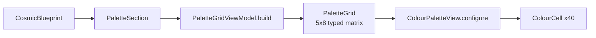

# Personal Palette Grid — UI Spec

> **Version:** v1  
> **Phase:** B of the Palette Rework programme  
> **Hard prerequisites:**  
> 1. `docs/repo_rename_spec_v1.md` (Phase 0) merged — all paths in this spec use `docs/...`.  
> 2. `docs/palette_engine_rework_spec_v1.md` (Phase A) merged — this spec assumes the engine produces **exactly 4 core + 4 accent** anchors with `provenance` on every `BlueprintColour`.  
> **Companion specs:** `docs/repo_rename_spec_v1.md`, `docs/palette_engine_rework_spec_v1.md`.

---

## 1. Hard Input Contract (Read First)

This work depends on Phase A's engine changes having landed. Before writing any code, verify the following on `main`:

- `PaletteSection.coreColours.count` is in `[3, 4]`.
- `PaletteSection.accentColours.count == 4` for both fixture users.
- `BlueprintColour` has a `provenance` field.

If any of these is not true, **stop and escalate**. You're starting too early. Do not attempt to build "2 → 4 extrapolation" or defensive fallback logic in the UI — that is explicitly out of scope. The UI is a pure consumer of engine truth.

## 2. Scope

Replace the hard-coded 5×7 placeholder grid in `Cosmic Fit/UI/Views/ColourPaletteView.swift` with a **dynamic 5×8 grid** driven by `PaletteSection`.

**In scope:**

- New folder `Cosmic Fit/UI/Views/Palette/`.
- New types: `PaletteGrid`, `PaletteRow`, `PaletteCell`.
- New pure-Swift view-model: `PaletteGridViewModel`.
- New shared utility: `ColourMath` (HSL math extracted from `PaletteSwatchGenerator`).
- Refactor of `ColourPaletteView`: new API, `intrinsicContentSize` support.
- Extraction of `ColourCell` from its current inner-class position in `ColourPaletteView.swift`.
- Update to `StyleGuideViewController.swift` call site.
- Xcode project / target membership updates for all new & moved files.

**Out of scope (non-goals):**

- Changing the engine's anchor counts, tone counts, or `PaletteSwatchGenerator` internals.
- Editing palette (chart-determined once per user — not a feature).
- Sharing palette (deferred; revisit in a later programme).
- Daily Fit palette integration (`DailyColourPaletteView` is a separate component).
- Consuming `BlueprintColour.provenance` in the UI (exists for tests/logs; no v1 surface).
- Consuming `SwatchFamily.tones` for grid cells (see §6 — UI does its own tone expansion).
- Changing frozen WP2 / WP3 contracts (Phase A's territory).

## 3. Current State (Baseline)

- UI: `Cosmic Fit/UI/Views/ColourPaletteView.swift`.
- Today's grid: **5 columns × 7 rows = 35 cells**, all `UIColor` literals hard-coded in `createPlaceholderPalette()` at lines 151–212.
- Today's caller: `Cosmic Fit/UI/ViewControllers/StyleGuideViewController.swift` line 476 (`case .palette:`) — and **this is the only production call site** (verified via repo-wide grep).
- `ColourCell` lives as an inner class at `ColourPaletteView.swift` lines 108–144.

Phase B ships a **5 × 8 = 40 cell** grid, dynamically sourced from engine data, replacing the placeholder.

## 4. Grid Specification

- **Columns:** 5 (fixed).
- **Rows:** 8 (fixed).
- **Bands:**
  - Core band: rows 1–4 (top 20 cells).
  - Accent band: rows 5–8 (bottom 20 cells).
  - Band separator: **1× row height** of empty vertical space between row 4 and row 5.
- **Cell shape:** square; corner radius **4 pt** (existing value); inter-cell spacing **2 pt** (existing value).
- **Container:** horizontal padding aligns with the detail page body text container. The view itself does not add outer insets.
- **Scrolling:** disabled (the parent `ScrollView` in `StyleGuideDetailViewController` owns vertical scroll).
- **Orientation:** portrait only (already enforced at app level).

### 4.1 Row = anchor family

Each **row** represents one anchor colour expanded to **5 display tones**, left → right, light → dark:

| Column | Tone offset from anchor L (HSL) | Role name |
|--------|---------------------------------|-----------|
| 1 | L + 0.30 (clamp ≤ 0.95) | lightest |
| 2 | L + 0.15 (clamp ≤ 0.92) | light |
| 3 | L (anchor) | true |
| 4 | L − 0.15 (clamp ≥ 0.08) | dark |
| 5 | L − 0.30 (clamp ≥ 0.05) | darkest |

Saturation: clamp ±0.08 around anchor S to avoid washed-out lights. These are **display expansion** values — they do NOT mutate `SwatchFamily.tones` (the engine's authoritative per-family tones remain 3 for core / 2 for accent and are used elsewhere, not here).

### 4.2 Cell labels

**Decision: no visible labels in v1.** Figma's 3-digit decorative codes are deliberately omitted. Cells are clean colour blocks. If labels are required later, derivation would be a pure function over hex and is trivial to add.

### 4.3 Empty row handling

**Decision: show faint empty cells at 8% neutral opacity** when a row has no anchor (e.g. if core band has only 3 anchors). This keeps the 5×8 silhouette stable regardless of content.

Implement behind a `PaletteGrid.hidesEmptyRows: Bool` computed property defaulting to `false`. Flip-to-collapse is a one-line product change later.

### 4.4 Tap interaction

**Decision: decorative only, no tap.** Cells are not tappable in v1. No `UITapGestureRecognizer`, no context menus.

---

## 5. Data Flow



- `PaletteGridViewModel.build(from: PaletteSection) -> PaletteGrid` — pure function, Foundation-only, zero `UIKit`, 100% unit-testable.
- `PaletteGrid` — pure data, `Equatable`, hex-string-based.
- `ColourPaletteView.configure(with: PaletteGrid)` — the only way to set grid content.
- `ColourCell` — extracted from `ColourPaletteView.swift` into its own file, minor refactor only.

No UI type touches `CosmicBlueprint` or `PaletteSection` directly. No business logic uses `UIColor`.

---

## 6. Tone Expansion Ownership (Important)

The grid shows **5 cells per row**. The engine produces **3 tones per core family, 2 per accent family** via `PaletteSwatchGenerator`. These numbers don't match — and they don't need to.

**`SwatchFamily.tones` is NOT consumed by this UI.** The grid reads `PaletteSection.coreColours[i].hexValue` and `accentColours[i].hexValue` directly, and the view-model independently expands each anchor hex to 5 display cells using `ColourMath.tonalOffsets`.

This keeps:

- The engine contract unchanged (`PaletteSwatchGenerator` untouched — Phase A's non-goal and this spec's non-goal).
- Narrative consumers of `SwatchFamily.tones` unaffected.
- Display logic entirely in the UI layer where it belongs.

If a future product decision says "use the engine's tones, not display offsets", that's a single change in `PaletteGridViewModel.expand(anchorHex:)`. The architecture supports it without engine changes.

---

## 7. Types

All new, in `Cosmic Fit/UI/Views/Palette/`.

### 7.1 `PaletteGrid.swift`

```swift
import Foundation

struct PaletteGrid: Equatable {
    /// Exactly 8 rows, each exactly 5 cells.
    let rows: [PaletteRow]

    static let columnCount: Int = 5
    static let rowCount: Int = 8
    static let coreRowCount: Int = 4

    /// If true, rows with no anchor are hidden and the grid's
    /// intrinsic height shrinks accordingly. Default: false.
    var hidesEmptyRows: Bool = false
}

struct PaletteRow: Equatable {
    let role: ColourRole         // .core or .accent (uses engine's enum)
    let anchorName: String?      // nil for empty/padded rows
    let anchorHex: String?       // nil for empty/padded rows
    let cells: [PaletteCell]     // exactly 5
}

struct PaletteCell: Equatable {
    enum Kind: Equatable {
        case filled(hex: String)
        case empty
    }
    let kind: Kind
    let toneIndex: Int           // 0...4 (lightest ... darkest)
}
```

Rationale: view is dumb; view-model is pure; model mirrors the rendered grid shape. Empty cells are explicit, not nil arrays.

### 7.2 `PaletteGridViewModel.swift`

Pure function with a `static build(from:)` entry point.

```swift
import Foundation

enum PaletteGridViewModel {

    /// Build the 5x8 grid from a PaletteSection. Always returns exactly
    /// 8 rows x 5 cells. Deterministic — same input produces byte-identical
    /// output.
    static func build(from section: PaletteSection) -> PaletteGrid {
        var rows: [PaletteRow] = []

        // Core band — up to 4 rows from section.coreColours.
        for i in 0..<PaletteGrid.coreRowCount {
            if i < section.coreColours.count {
                let anchor = section.coreColours[i]
                rows.append(buildFilledRow(anchor: anchor, role: .core))
            } else {
                rows.append(buildEmptyRow(role: .core))
            }
        }

        // Accent band — up to 4 rows from section.accentColours.
        let accentRowCount = PaletteGrid.rowCount - PaletteGrid.coreRowCount
        for i in 0..<accentRowCount {
            if i < section.accentColours.count {
                let anchor = section.accentColours[i]
                rows.append(buildFilledRow(anchor: anchor, role: .accent))
            } else {
                rows.append(buildEmptyRow(role: .accent))
            }
        }

        return PaletteGrid(rows: rows)
    }

    // MARK: - Private

    private static func buildFilledRow(anchor: BlueprintColour, role: ColourRole) -> PaletteRow {
        let hexes = expandToFiveTones(anchorHex: anchor.hexValue)
        let cells = hexes.enumerated().map { index, hex in
            PaletteCell(kind: .filled(hex: hex), toneIndex: index)
        }
        return PaletteRow(
            role: role,
            anchorName: anchor.name,
            anchorHex: anchor.hexValue,
            cells: cells
        )
    }

    private static func buildEmptyRow(role: ColourRole) -> PaletteRow {
        let cells = (0..<PaletteGrid.columnCount).map {
            PaletteCell(kind: .empty, toneIndex: $0)
        }
        return PaletteRow(role: role, anchorName: nil, anchorHex: nil, cells: cells)
    }

    /// Expand an anchor hex to 5 display tones (lightest to darkest)
    /// using ColourMath. Malformed hex falls back to neutral grey;
    /// a single warning is logged.
    private static func expandToFiveTones(anchorHex: String) -> [String] {
        let offsets = ColourMath.tonalOffsets  // [+0.30, +0.15, 0, -0.15, -0.30]
        let saturationClamp = 0.08              // +/-

        guard let (h, s, l) = ColourMath.hexToHSL(anchorHex) else {
            print("[PaletteGridViewModel] Warning: invalid hex '\(anchorHex)', falling back to #808080")
            return Array(repeating: "#808080", count: 5)
        }

        return offsets.map { offset in
            let newL = (l + offset).clamped(to: 0.05...0.95)
            let newS = s.clamped(to: (s - saturationClamp)...(s + saturationClamp))
                       .clamped(to: 0.0...1.0)
            return ColourMath.hslToHex(h: h, s: newS, l: newL)
        }
    }
}
```

(Adapt `clamped(to:)` to your preferred extension or use `min`/`max` inline.)

### 7.3 `ColourMath.swift` (new)

Extract HSL conversion from `Cosmic Fit/InterpretationEngine/PaletteSwatchGenerator.swift` lines 83–145 (`hexToHSL` / `hslToHex` / any helpers) into a shared `internal` utility.

**Location decision:** place at `Cosmic Fit/UI/Views/Palette/ColourMath.swift` (UI-adjacent since both UI and engine use it). Alternative: `Cosmic Fit/InterpretationEngine/ColourMath.swift` — either is acceptable. Record your choice in the PR.

```swift
import Foundation

enum ColourMath {

    /// Display-side tone offsets for grid expansion. Lightest → darkest.
    static let tonalOffsets: [Double] = [+0.30, +0.15, 0.0, -0.15, -0.30]

    /// Hex → (h, s, l). Returns nil for malformed input (use a fallback at call site).
    static func hexToHSL(_ hex: String) -> (h: Double, s: Double, l: Double)? {
        let cleaned = hex.trimmingCharacters(in: CharacterSet(charactersIn: "#"))
        guard cleaned.count == 6, let rgb = UInt32(cleaned, radix: 16) else {
            return nil
        }
        // ... move existing implementation from PaletteSwatchGenerator ...
    }

    static func hslToHex(h: Double, s: Double, l: Double) -> String {
        // ... move existing implementation from PaletteSwatchGenerator ...
    }
}
```

**Migration for `PaletteSwatchGenerator`:** replace its private `hexToHSL` / `hslToHex` calls with `ColourMath.hexToHSL` / `ColourMath.hslToHex`. **Zero behaviour change.** The existing `PaletteSwatchGenerator` tests must pass byte-identical before and after the extraction. Commit this extraction as its own first commit in Phase B.

Note one small signature difference: the existing `hexToHSL` returns a tuple unconditionally and defaults to `(0, 0, 0.5)` for bad hex. The new version returns `nil` for bad hex. Update `PaletteSwatchGenerator`'s call site to fall back to `(0, 0, 0.5)` if `ColourMath.hexToHSL` returns `nil`:

```swift
let (h, s, l) = ColourMath.hexToHSL(hex) ?? (0, 0, 0.5)
```

Preserves the engine's existing behaviour exactly.

### 7.4 `ColourCell.swift` — extraction, not creation

The existing inner class at `ColourPaletteView.swift` lines 108–144 moves into its own file at `Cosmic Fit/UI/Views/Palette/ColourCell.swift`. Preserve:

- `static let reuseIdentifier = "ColourCell"`.
- Corner radius 4 pt, clipsToBounds true.
- `configure(with colour: UIColor)` method.

Add one new method to support the empty-cell state:

```swift
final class ColourCell: UICollectionViewCell {
    static let reuseIdentifier = "ColourCell"

    // ... existing colourView subview and setup ...

    func configure(withHex hex: String) {
        colourView.backgroundColor = UIColor(hex: hex) ?? .gray
        colourView.alpha = 1.0
    }

    func configureEmpty() {
        colourView.backgroundColor = UIColor.label.withAlphaComponent(0.08)
        colourView.alpha = 1.0
    }
}
```

(If `UIColor(hex:)` doesn't already exist in the codebase, implement a small local helper; don't add a third-party dependency.)

---

## 8. `ColourPaletteView` — Refactored API

New public surface, replacing the current `init(colours: [[UIColor]])` path.

```swift
final class ColourPaletteView: UIView {
    init()                                  // empty grid (onboarding / default state)
    func configure(with grid: PaletteGrid)  // set content
    static func placeholder() -> PaletteGrid // deterministic demo grid for previews
}
```

**Removed (breaking but scoped to the single known call site):**

- `init(colours: [[UIColor]])`
- `createPlaceholderPalette() -> ColourPaletteView` (extension at line 147+)

**Placeholder semantics:** `ColourPaletteView.placeholder()` returns a deterministic `PaletteGrid` built from 4 made-up core anchors + 4 made-up accent anchors. Used by:

- Previews and tests.
- The `StyleGuideViewController` call site until real `PaletteSection` wiring lands (see P4 below).

**Empty cell rendering:** for `PaletteCell.Kind.empty`, cell uses `ColourCell.configureEmpty()` (theme neutral at 8% opacity).

**Layout:** autolayout-only. The view's height is derived from intrinsic content size:

```swift
override var intrinsicContentSize: CGSize {
    let columnCount = PaletteGrid.columnCount
    let rowCount = grid?.hidesEmptyRows == true ? nonEmptyRowCount : PaletteGrid.rowCount
    let interSpacing = cellSpacing * CGFloat(columnCount - 1)
    let width = bounds.width
    let cellSize = (width - interSpacing) / CGFloat(columnCount)
    let bandGap = cellSize // 1x row-height separator between rows 4 and 5
    let rowSpacing = cellSpacing * CGFloat(rowCount - 1)
    let height = cellSize * CGFloat(rowCount) + rowSpacing + bandGap
    return CGSize(width: width, height: height)
}
```

Override `invalidateIntrinsicContentSize()` when bounds change width so the enclosing scroll view re-flows.

### 8.1 Band separator implementation

The `UICollectionView` has no built-in per-section gap, but the cleanest approach is a custom layout that adds extra space before the first accent row. Two equally-valid options:

- **Option A:** use two `UICollectionView` sections (section 0 = core band rows 1–4, section 1 = accent band rows 5–8) and set `layout.sectionInset.top` for section 1 to inject the 1× row-height gap.
- **Option B:** use a single section of 8 rows and override `collectionView(_:layout:insetForSectionAt:)` / compute cell positions with an injected offset.

Option A is recommended — cleaner data source, fewer layout overrides.

### 8.2 StyleGuideViewController call site update

In `Cosmic Fit/UI/ViewControllers/StyleGuideViewController.swift` line 476 (`case .palette:`), replace:

```swift
let colourPalette = ColourPaletteView.createPlaceholderPalette()
```

with:

```swift
let colourPalette = ColourPaletteView()
colourPalette.configure(with: ColourPaletteView.placeholder())
```

This keeps placeholder behaviour until the real `CosmicBlueprint` wiring lands. See §10 P4.

---

## 9. Accessibility

- Each filled cell exposes `accessibilityLabel = "{anchorName} {toneRole}"`, e.g. `"sage true"`, `"saffron lightest"`.
- Empty cells: `isAccessibilityElement = false`.
- The grid as a whole is grouped under a single `accessibilityElement` on `ColourPaletteView` with label `"Personal palette"` for VoiceOver rotor summaries.
- All colour is decorative — no information is conveyed by colour alone. Anchor names are readable in the narrative text above the grid.
- Dynamic Type: the grid uses no text in v1, so no reflow concerns. If labels are added later, they must scale with Dynamic Type.

---

## 10. Phasing (Commit Structure)

| Step | Scope | Commit message (suggested) |
|------|-------|----------------------------|
| P1 | Extract `ColourMath`; migrate `PaletteSwatchGenerator` to use it. Zero behaviour change. | `refactor(engine): extract ColourMath from PaletteSwatchGenerator` |
| P2 | Add `PaletteGrid`, `PaletteRow`, `PaletteCell`, `PaletteGridViewModel`. Unit tests. No UI changes. | `feat(ui/palette): add PaletteGrid model and view-model` |
| P3 | Extract `ColourCell` to its own file. Refactor `ColourPaletteView` to new API. Add `intrinsicContentSize`. | `refactor(ui): ColourPaletteView to data-driven PaletteGrid API` |
| P4 | Update `StyleGuideViewController.swift:476` to use `ColourPaletteView.placeholder()`. Verify on device. | `feat(ui): wire StyleGuideViewController to new ColourPaletteView API` |

P5 (real `PaletteSection` wiring) is **deferred**. It belongs to whichever work connects `CosmicBlueprint` end-to-end to the Palette sub-page — not part of Phase B.

Each step runs green (build + tests + device check) before the next begins.

### 10.1 Xcode target membership — checklist

After every file add/move:

1. Open `Cosmic Fit.xcworkspace` in Xcode.
2. Confirm the new file appears in the Project Navigator.
3. In File Inspector > Target Membership, confirm `Cosmic Fit` is checked.
4. For test files: confirm `Cosmic FitTests` is checked.
5. Build from a clean fresh checkout (`Product > Clean Build Folder`, then build) to confirm.

The project file has been checked and contains zero `_reference` references; Phase 0 does not touch it. But this spec *does* add/move files, so Phase B must update it.

---

## 11. Testability

### 11.1 Unit tests — `PaletteGridViewModel`

Add to the existing WP2 contract test suite.

- **Happy path (4 core + 4 accent):** fixture `PaletteSection` in → grid with all 8 rows filled, 5 filled cells each.
- **Short core (3 core + 4 accent):** 3 core filled rows + 1 empty core row + 4 accent filled rows.
- **Malformed hex input:** `BlueprintColour(hexValue: "not-a-hex", ...)` → row's cells all render as `#808080`; single warning logged; no crash.
- **Determinism:** build from the same `PaletteSection` 10 times → byte-identical `PaletteGrid` each time.

### 11.2 Unit tests — `ColourMath`

- `tonalOffsets` applied to a range of anchor L values produces clamped output inside `[0.05, 0.95]` for all inputs.
- `hexToHSL` → `hslToHex` round-trip for a set of known colours stays within 1 channel unit.
- Invalid hex strings (`"#ZZZZZZ"`, `"abc"`, `""`) return `nil`.

### 11.3 Byte-identity tests — fixtures

- Snapshot the `PaletteGrid` produced for fixture users 1 and 2 against a golden file at `docs/fixtures/palette_grid_golden_user_1.json` and `_user_2.json`. Any unintended change will fail the test.

### 11.4 UI previews (optional, SwiftUI `UIViewRepresentable`)

One preview per fixture for eyeball checks during dev. These don't ship but aid review.

---

## 12. Acceptance Criteria

- [ ] `ColourPaletteView` always renders a **5 × 8** grid with a visible band gap between rows 4 and 5.
- [ ] Given identical `PaletteSection` input, produces identical `PaletteGrid` across runs.
- [ ] No dependency on `UIColor` in business logic (`PaletteGridViewModel` is Foundation-only, hex-string-based).
- [ ] No reads from `CosmicBlueprint` in the view itself; the view takes `PaletteGrid` only.
- [ ] `ColourMath` extraction causes zero behaviour change in `PaletteSwatchGenerator` tests.
- [ ] `SwatchFamily.tones` is NOT read on the UI path (grep the UI module to confirm).
- [ ] Unit tests cover: deterministic build, malformed hex fallback, short-anchor input, full-anchor input, hue clamp boundaries.
- [ ] Palette sub-page renders `ColourPaletteView.placeholder()` end-to-end on-device; visible on smallest supported device width (iPhone SE class) without overflow or layout shift.
- [ ] All new & moved files have correct Xcode target membership (`Cosmic Fit` for source, `Cosmic FitTests` for tests).
- [ ] Clean build from a fresh checkout succeeds.
- [ ] `StyleGuideViewController.swift:476` updated to the new API.
- [ ] `init(colours: [[UIColor]])` and `createPlaceholderPalette() -> ColourPaletteView` removed; no remaining callers (grep confirms).

---

## 13. Risks

- **Engine contract drift.** If Phase A shipped fewer than 4 accents, halt and escalate. Do not patch in the UI.
- **Band symmetry perception.** 4 accent rows on the grid may read as "I have 4 accent colours" even though the user's narrative references fewer. Mitigation: UI is honest to engine truth — if Phase A's diagnostic produced 4, narrative text will name 4 too (Phase A cache regen).
- **Dynamic Type / label fonts.** Not a concern in v1 (no labels). If added later, adds reflow complexity.
- **Layout on narrow screens.** iPhone SE-class widths: 5 columns + 4 spacings + cell padding. Cell size will be ~65pt. Verify no sub-pixel overflow. If overflow appears, reduce `cellSpacing` from 2 pt to 1 pt as a visual-imperceptible fix.
- **Section insets overwriting band gap.** If using Option A (two sections), ensure `sectionInset.top` on section 1 does not stack with the collection view's contentInset. Verify on device.

## 14. Non-Goals (Re-stated)

- Editing palette (chart-determined once per user — not a feature).
- Sharing palette (deferred).
- Daily Fit palette integration (`DailyColourPaletteView`, separate).
- Changing `PaletteSwatchGenerator` tone counts.
- Consuming `BlueprintColour.provenance` in the UI.
- Consuming `SwatchFamily.tones` for grid cells.
- Changing WP2 / WP3 frozen contracts.
- End-to-end `CosmicBlueprint` → Palette sub-page wiring (that's a later, separately-scoped piece of work).

---

## 15. Companion Notice

This spec consumes Phase A's engine output. If you spot any behaviour that contradicts `docs/palette_engine_rework_spec_v1.md` (e.g. fewer than 4 accents, missing `provenance`, fixture shape drift), **do not fix it in the UI**. Escalate to the programme owner so Phase A can be patched or rolled back cleanly.

---

*Authored as part of the Palette Rework programme. Phase 0 (`repo_rename_spec_v1.md`) and Phase A (`palette_engine_rework_spec_v1.md`) are hard prerequisites. P5 (real `PaletteSection` wiring from live `CosmicBlueprint`) is deferred to a later programme.*
