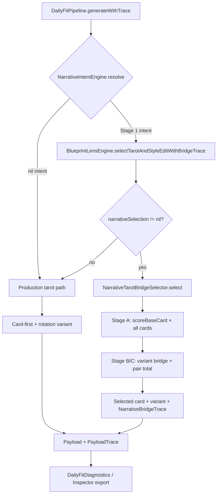

# Daily Fit — Narrative Tarot Bridge Follow-Up (Architecture & Cleanup)

**Status:** Follow-up handoff — post-implementation audit  
**Date:** 2026-05-23  
**Audience:** Engineer or AI agent doing thoughtful refactor / Phase 2 work  
**Scope:** Resolve three known gaps from the Narrative Tarot Bridge Phase 1 implementation. **Out of scope:** re-implementing the bridge, changing production tarot behaviour, adding user-facing copy, modifying `TarotCards.json`, or changing `NarrativeIntentEngine` classification rules.

**Primary spec (already implemented — Phase 1):**

| Doc | Role |
|-----|------|
| [`daily_fit_narrative_tarot_bridge_handoff.md`](./daily_fit_narrative_tarot_bridge_handoff.md) | Original feature spec — §5, §7, §8, §10 |

**Related docs:**

| Doc | Role |
|-----|------|
| [`daily_fit_narrative_unification_v1_cleanup_v1_1_handoff.md`](./daily_fit_narrative_unification_v1_cleanup_v1_1_handoff.md) | Parent narrative intent / v1.1 biasing context |
| [`daily_fit_stage1_experimental_app_readiness_handoff.md`](./daily_fit_stage1_experimental_app_readiness_handoff.md) | Stage 1 app / inspector parity |
| [`../fixtures/narrative_tarot_bridge_signoff_2026-05-23.md`](../fixtures/narrative_tarot_bridge_signoff_2026-05-23.md) | Phase 1 sign-off fixture |

---

## 0. Context — what already landed (Phase 1)

The Narrative Tarot Bridge feature is **functionally complete for Phase 1 merge** (trace export + joint selection on Stage 1 only):

### Delivered behaviour

- **Joint (card, variant) selection** when `narrativeIntent != nil` **and** `calibration.narrativeSelection != nil`.
- **Astro funnel mandatory:** vibe + axis + transit − recency → top `bridgeCandidatePoolSize` cards → variant bridge scoring → pair total score.
- **Single source of truth:** `BlueprintLensEngine.selectTarotAndStyleEditWithBridgeTrace` used by both `generatePayload` and `generatePayloadWithTrace`.
- **Trace export:** `NarrativeBridgeTrace` on `PayloadTrace`, `DailyFitDiagnosticReport`, inspector markdown (`### Narrative bridge`).
- **Coherence:** `variantBridgeSimilarity` + `bridgePass` traced on `NarrativeCoherenceTrace`; **Phase 1 does not fail `overallPass`** on bridge yet.
- **Zero new UI copy:** app still renders existing `styleEditVariant` fields from `TarotCards.json`.

### Engine safety confirmed

| Gate | Mechanism |
|------|-----------|
| Production unchanged | `DailyFitCalibration.default` has `narrativeSelection == nil` → bridge branch unreachable |
| Nil-intent unchanged | Production path uses existing card-first + rotation variant selection |
| Fingerprint guard | `ProductionFingerprintGuard_Tests` green before and after |
| Stage 1 only | Bridge runs via `stage1_experimental` calibration + resolved narrative intent |

### Files touched (Phase 1)

| File | Change |
|------|--------|
| `Cosmic Fit/InterpretationEngine/NarrativeTarotBridgeSelector.swift` | **NEW** — joint selector + `scoreBaseCard` |
| `Cosmic Fit/InterpretationEngine/BlueprintLensEngine.swift` | Unified tarot path; `TarotSelectionResult`; bridge branch |
| `Cosmic Fit/InterpretationEngine/DailyFitTypes.swift` | Bridge tuning fields; `NarrativeBridgeTrace`; coherence extensions |
| `Cosmic Fit/InterpretationEngine/DailyFitEngineRegistry.swift` | Fingerprint includes bridge tuning params |
| `Cosmic Fit/InterpretationEngine/NarrativeSelectionDirectives.swift` | `computeCoherenceTrace` accepts `bridgeTrace` |
| `Cosmic Fit/InterpretationEngine/DailyFitPipeline.swift` | Threads bridge trace to coherence |
| `Cosmic Fit/InterpretationEngine/DailyFitDiagnostics.swift` | `narrativeBridgeTrace` on diagnostic report |
| `inspector/Sources/CosmicFitInspectorServer/Web/app.js` | Narrative bridge markdown section |
| `Cosmic FitTests/NarrativeTarotBridge_Tests.swift` | **NEW** — 8 tests |
| `docs/fixtures/narrative_tarot_bridge_signoff_2026-05-23.md` | **NEW** — Phase 1 sign-off |

### Tests (Phase 1 green)

- `NarrativeTarotBridge_Tests` (8)
- `ProductionFingerprintGuard_Tests`
- `NarrativeTarotUnification_Tests`
- `NarrativeCoherence_Briar_Tests`
- `DailyFitSkyForwardV2_Tests`

### Calibration chosen (Phase 1 defaults)

| Tunable | Value |
|---------|-------|
| `variantBridgeWeight` | 0.25 |
| `bridgeCandidatePoolSize` | 15 |
| `minVariantBridgeSimilarity` | 0.50 |
| `minBridgeMargin` | 0.01 |
| `pairScoreTieEpsilon` | 0.01 |

### Deferred from primary spec (not this handoff's job unless noted)

- **Phase 2 enforcement:** enable `bridgePass` in `computeCoherenceTrace overallPass` (requires Ash sign-off + contrast-day manual read; Briar 14-day target ≥ 12/14 pass).
- **Linden/Wren tuning:** needs inspector-derived natal fixtures.
- **Wren template variety:** separate ticket.

**This handoff is not a re-implementation.** It is architecture cleanup and test hygiene for audit findings.

---

## 1. Implementation handoff prompt (copy-paste)

```
Read docs/handoff/daily_fit_narrative_tarot_bridge_followup_handoff.md in full before coding.

Mission: Resolve the three follow-up items (§2–§4) from the post-implementation audit.
Do not re-implement the Narrative Tarot Bridge from scratch.

Hard constraints (unchanged from original spec):
- STAGE 1 ONLY — bridge when narrativeIntent != nil AND calibration.narrativeSelection != nil.
- Production / Release paths must remain byte-identical (ProductionFingerprintGuard_Tests green).
- ZERO new user-facing copy. Do not modify TarotCards.json.
- Do not change NarrativeIntentEngine classification rules.
- Joint (card, variant) selection must remain — no card-first-then-variant regression.
- Astro funnel must still honour vibe + axis + transit − recency before bridge scoring.

Deliver in order:
1. Shared tarot scoring extraction (§2) — do first; highest architectural value
2. Soften min-drama determinism (§3) — small, testable
3. Test helper consolidation (§4) — cleanup + restore true determinism test

Stop and run after each item:
- NarrativeTarotBridge_Tests
- ProductionFingerprintGuard_Tests
- NarrativeTarotUnification_Tests
- NarrativeCoherence_Briar_Tests

Inspector: cd inspector && swift build
```

---

## 2. Issue 1 — Duplicated transit / recency scoring logic

### Problem

`NarrativeTarotBridgeSelector.scoreBaseCard(...)` reimplements logic that already exists on `BlueprintLensEngine`:

| Duplicated element | Locations |
|--------------------|-----------|
| `planetEnergyAffinities` table | `BlueprintLensEngine` ~L254–265 **and** `NarrativeTarotBridgeSelector` ~L213–224 |
| `transitBoost(for:dominantTransits:)` | `BlueprintLensEngine` ~L269–287 **and** `NarrativeTarotBridgeSelector` ~L226–242 |
| `recencyPenalty(for:recentSelections:)` | `BlueprintLensEngine` ~L292–312 **and** `NarrativeTarotBridgeSelector` ~L244–260 |

The bridge copy was created because `BlueprintLensEngine.transitBoost` / `recencyPenalty` are **`private static`**, so the new selector could not call them without visibility changes.

**Risk:** If transit or recency tuning changes in one place, the bridge funnel silently diverges. Today both paths are byte-identical copies, but that is accidental, not enforced.

**Mitigation today:** Bridge only runs on Stage 1 experimental; production uses the nil-intent path in `BlueprintLensEngine` and never touches the bridge copy. Still, Stage 1 card funnel scores could drift from inspector trace card scores if only one copy is updated.

### Additional drift vector

`generatePayloadWithTrace` still builds a **separate** card-score trace loop (~L517–540 in `BlueprintLensEngine.swift`) for inspector display. It inlines vibe/axis/transit/recency again (plus narrative boost when bridge active). After §2, this loop should also call the shared scorer — three copies → one.

### Recommended solution (thoughtful — not a patch)

**Extract a shared, testable scoring module** used by all tarot card scoring paths.

#### Option A (preferred): `TarotCardScoring` enum

Create `Cosmic Fit/InterpretationEngine/TarotCardScoring.swift`:

```swift
enum TarotCardScoring {
    static func transitBoost(for card: TarotCard, dominantTransits: [DailyTransitSummary]) -> Double
    static func recencyPenalty(for cardName: String, recentSelections: [...]) -> Double
    static func baseScore(
        card: TarotCard,
        normAxes: [String: Double],
        vibeVector: [String: Double],
        axesVector: [String: Double],
        weights: DailyFitCalibration.SelectionWeights,
        recentSelections: [...],
        dominantTransits: [DailyTransitSummary],
        narrativeBoost: Double = 0  // precomputed category boost, 0 for production path
    ) -> Double
}
```

Move `planetEnergyAffinities` here once. Both `BlueprintLensEngine` and `NarrativeTarotBridgeSelector` delegate to it.

**Why this is better than making BlueprintLensEngine methods `internal`:**
- Keeps `BlueprintLensEngine` focused on payload assembly, not low-level scoring primitives.
- Gives tests a single place to assert transit/recency invariants.
- Avoids widening visibility on a large engine enum just for one caller.

#### Option B (acceptable): widen visibility on existing methods

Change `BlueprintLensEngine.transitBoost`, `recencyPenalty`, and `planetEnergyAffinities` from `private` to `internal`. Have `NarrativeTarotBridgeSelector.scoreBaseCard` call them directly.

**Downside:** Still leaves `scoreBaseCard`'s vibe/axis/weight assembly duplicated between bridge and production loop. Prefer Option A unless minimising new files is critical.

### Implementation steps

1. Add `TarotCardScoring.swift` with the three functions (lift verbatim from `BlueprintLensEngine` — they are identical today).
2. Replace `BlueprintLensEngine.transitBoost` / `recencyPenalty` bodies with forwards to `TarotCardScoring`.
3. Replace `NarrativeTarotBridgeSelector` private copies with forwards to `TarotCardScoring`.
4. Refactor `NarrativeTarotBridgeSelector.scoreBaseCard` to call `TarotCardScoring.baseScore(...)` with narrative boost computed separately (or as parameter).
5. Refactor `generatePayloadWithTrace` trace loop to use the same helper for per-card trace rows.
6. Add **`TarotCardScoring_Tests`** (or extend `NarrativeTarotBridge_Tests`) with at least:
   - recency tier thresholds (≤2 → 0.45, ≤6 → 0.25, ≤10 → 0.12, frequency escalation, cap 0.7)
   - transit boost cap at 1.0
   - **cross-caller parity:** same inputs → same score from bridge path and trace path

### Acceptance criteria

- [ ] Exactly **one** copy of `planetEnergyAffinities`, transit boost, and recency penalty in the codebase.
- [ ] `ProductionFingerprintGuard_Tests` still green (production scores unchanged).
- [ ] Stage 1 Briar day selections unchanged for fixed seed + history (no behaviour drift from refactor).
- [ ] Inspector tarot score trace rows still match funnel base scores for bridge days.

### Do NOT

- Change recency thresholds or transit affinity values as part of this refactor (behaviour-preserving move only).
- Inline a fourth copy anywhere.

---

## 3. Issue 2 — Non-deterministic iteration in `applySoftenMinDramaRule`

### Problem

```swift
// NarrativeTarotBridgeSelector.swift ~L263–301
var grouped: [String: [Candidate]] = [:]
for pair in pairs { grouped[pair.card.name, default: []].append(pair) }
for (_, cardPairs) in grouped { ... }  // Dictionary iteration order is undefined
```

The final winner is chosen by sorting `pairs` by `pairTotalScore`, so **correctness is usually fine**. However:

- Intermediate promotion of min-drama variants mutates scores before the final sort.
- If two cards' promotions interact through floating-point ordering edge cases, undefined iteration order could theoretically affect which promoted score wins a tie.
- This likely contributed to **flaky `deterministicPair` test** behaviour during Phase 1 (test was later rewritten to internal-consistency checks instead of two-run parity).

### Recommended solution (thoughtful — not a patch)

**Make grouping iteration explicitly stable** without changing soften semantics:

```swift
let grouped = Dictionary(grouping: pairs, by: { $0.card.name })
for cardName in grouped.keys.sorted() {
    guard let cardPairs = grouped[cardName] else { continue }
    // existing top-3 min-drama logic unchanged
}
```

Alternatively, sort `cardPairs` by `variantIndex` before top-3 selection so tie-breaking within a card is stable.

### Stronger test to add after fix

Restore a **true two-run determinism test** (replacing the current internal-consistency-only `deterministicPair`):

```swift
@Test("Deterministic pair: same inputs → same card + variant")
func deterministicPair() {
    TarotCalibrationTestSupport.installIsolatedTrackers()
    defer { TarotCalibrationTestSupport.resetTrackersForProfile() }

    // Call NarrativeTarotBridgeSelector.select directly (no recency tracker side effects)
    // Same snapshot, allCards, empty recentSelections, intent, calibration, dailySeed
    // Assert result1 == result2 (card name, variant title, variantBridgeScore, pairTotalScore)
}
```

Direct selector calls avoid `TarotRecencyTracker` mutation between pipeline runs — the root cause of the original flaky test.

### Acceptance criteria

- [ ] `applySoftenMinDramaRule` iterates grouped cards in **sorted key order** (or equivalent stable ordering).
- [ ] Direct-selector determinism test passes across **multiple repeated invocations** in one test (e.g. 10 loops).
- [ ] Soften-day behaviour unchanged on Briar fixtures (if any soften days exist in window) or synthetic soften intent fixture.

---

## 4. Issue 3 — Redundant test helper `generateBriarTraceWithHash`

### Problem

`NarrativeTarotBridge_Tests.swift` defines two helpers:

| Helper | `profileHash` |
|--------|---------------|
| `generateBriarTrace(for:)` | `SkyForwardV2Support.briarHash` |
| `generateBriarTraceWithHash(for:hash:)` | caller-supplied |

They are **~95% identical**. After the determinism test rewrite, **`generateBriarTraceWithHash` is dead code** (defined but uncalled).

### Recommended solution

Consolidate to a single helper with a default parameter:

```swift
private func generateBriarTrace(
    for date: Date,
    profileHash: String = SkyForwardV2Support.briarHash
) -> (...) {
    // single implementation
}
```

Delete `generateBriarTraceWithHash`. Update any future tests needing isolation to pass an explicit hash.

### Acceptance criteria

- [ ] One Briar trace helper in `NarrativeTarotBridge_Tests.swift`.
- [ ] All existing bridge tests still pass without behaviour change.

---

## 5. Verification checklist (full pass before closing this handoff)

```bash
# From repo root — use a booted simulator
xcodebuild test -scheme "Cosmic Fit" \
  -destination "platform=iOS Simulator,name=iPhone 16 Pro" \
  -only-testing:"Cosmic FitTests/NarrativeTarotBridge_Tests" \
  -only-testing:"Cosmic FitTests/ProductionFingerprintGuard_Tests" \
  -only-testing:"Cosmic FitTests/NarrativeTarotUnification_Tests" \
  -only-testing:"Cosmic FitTests/NarrativeCoherence_Briar_Tests"

cd inspector && swift build
```

Manual (Stage 1):

1. Run app with `stage1_experimental` engine override.
2. Inspector export shows `### Narrative bridge` with populated fields.
3. Production engine export shows **no** narrative bridge section.

---

## 6. Optional next work (separate from this handoff)

These were intentionally deferred from Phase 1; do not bundle into §2–§4 unless explicitly requested:

| Item | Spec reference | Notes |
|------|----------------|-------|
| Phase 2 `bridgePass` enforcement | §5.8 Phase 2, §10 | Failed Briar coherence tests when enabled prematurely; needs tuning + Ash sign-off |
| Contrast-day manual QA | §10 acceptance | `relationship == contrast && overlapCount == 0` days |
| Linden/Wren 14-day bridge stats | §4 sign-off | Extend sign-off fixture beyond Briar |
| `variantBridgeWeight` tuning | sign-off doc | Start 0.25; adjust from export data |

---

## 7. Architecture diagram (current Phase 1 flow)



**After §2 refactor:** `scoreBaseCard` and production trace loop both call `TarotCardScoring` — single scoring source.

---

## 8. Summary for incoming agent

| Priority | Issue | Effort | Risk |
|----------|-------|--------|------|
| **P1** | Shared `TarotCardScoring` extraction (§2) | Medium | Low if behaviour-preserving |
| **P2** | Stable soften grouping (§3) | Small | Low |
| **P3** | Test helper consolidation (§4) | Trivial | None |

Phase 1 Narrative Tarot Bridge is **merge-ready**. This follow-up makes the architecture **maintainable** and restores **provable determinism** — not feature expansion.
