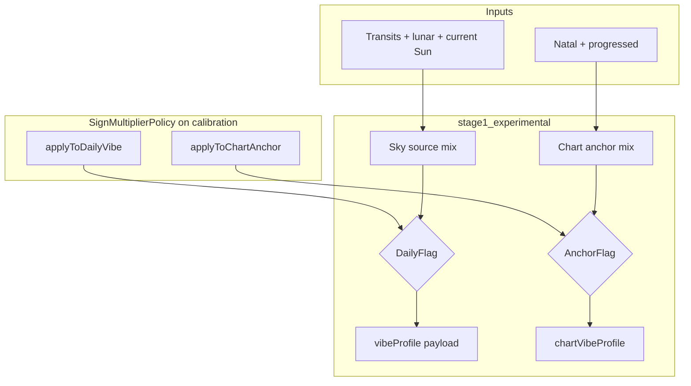

# Daily Fit — Sign Multiplier Policy (Centralized Toggle) — Handoff

**Status:** Implemented (2026-05-22)  
**Date:** 2026-05-22  
**Task type:** Implementation — Daily Fit engine only  
**Audience:** Engineer or AI agent implementing centralized natal Sun sign-multiplier on/off control  
**Product decision (Ash):** Implement **audit Option A** for `stage1_experimental` — daily sky vibe **OFF**, chart anchor **ON**. Production and legacy baseline **unchanged**.

**Related docs:**
- [`docs/fixtures/daily_fit_sign_energy_audit_report.md`](../fixtures/daily_fit_sign_energy_audit_report.md) — audit Option A / B framing
- [`docs/handoff/daily_fit_sign_energy_implementation_handoff.md`](daily_fit_sign_energy_implementation_handoff.md) — **separate ticket** for 13-cell `signEnergyMap` float tuning (Phase 1 floats)
- [`docs/handoff/daily_fit_sky_forward_v2_refactor_handoff.md`](daily_fit_sky_forward_v2_refactor_handoff.md) — stage1 sky-forward refactor; **this policy is prerequisite Step 0**
- [`docs/handoff/inspector_derivation_drilldown_handoff.md`](inspector_derivation_drilldown_handoff.md) — vibe drill-down raw → post-mult → final

**Scope:** Daily Fit (`DailyFitCalibration`, `DailyEnergyEngine`, registry, diagnostics, inspector labels). **Not** Style Guide / Blueprint.

---

## 1. Executive summary

### 1.1 What Ash asked for

> A centralized flag/param to turn natal Sun `signEnergyMap` multipliers on or off, with **`stage1_experimental` defaulting to Option A** (off on daily sky vibe).

### 1.2 What Option A means here

| Path | Sign multipliers |
|------|------------------|
| **Daily sky vibe** (payload `vibeProfile` / `skyVibeProfile`) | **OFF** — fashion weather from transits, Moon, etc. |
| **Chart anchor vibe** (`chartVibeProfile`, comparison only) | **ON** — natal Sun identity reference frame |
| **Production / legacy daily vibe** | **ON** — unchanged from today |

This is **not** “remove sign multipliers entirely.” Chart anchor still shows “who you are”; daily bars show “what today’s sky feels like.”

### 1.3 Current state (partial Option A already exists)

In [`DailyEnergyEngine.swift`](../../Cosmic Fit/InterpretationEngine/DailyEnergyEngine.swift), `stage1_experimental` already uses hardcoded booleans:

| Slice | `shouldApplySignMultipliers` today |
|-------|-------------------------------------|
| Sky daily payload | `false` (lines ~90, ~673) |
| Chart anchor | `true` (lines ~80, ~663) |
| Standard / production full-mix | always applied in `generateVibeProfile` |

**Gaps this ticket closes:**

1. Replace magic booleans with **one calibration surface** (`SignMultiplierPolicy`).
2. Fix **misleading diagnostics** — `generateSnapshotWithTrace` always multiplies trace `postMultiplierScores` even when sky payload was not multiplied.
3. Surface policy in **inspector** so drill-down matches payload truth.
4. Include policy in **engine fingerprint** for A/B traceability.

---

## 2. Architecture

### 2.1 Pipeline (target)



### 2.2 Engine preset defaults

| Preset | `applyToDailyVibe` | `applyToChartAnchor` | Notes |
|--------|-------------------|----------------------|-------|
| `production` | **true** | false | Standard mode has no chart-anchor payload |
| `legacy_baseline` | **true** | false | Same daily behaviour as production |
| `stage1_experimental` | **false** | **true** | Option A |

Optional preset for testing: `SignMultiplierPolicy.off` (both false) — do not ship as default.

---

## 3. Implementation — types

**File:** [`Cosmic Fit/InterpretationEngine/DailyFitTypes.swift`](../../Cosmic Fit/InterpretationEngine/DailyFitTypes.swift)

Add nested struct on `DailyFitCalibration`:

```swift
struct SignMultiplierPolicy: Equatable {
    /// Standard full-mix path + stage1 sky payload (vibeProfile / skyVibeProfile).
    let applyToDailyVibe: Bool
    /// stage1 chart anchor comparison slice only (chartVibeProfile).
    let applyToChartAnchor: Bool

    static let productionDefault = SignMultiplierPolicy(
        applyToDailyVibe: true, applyToChartAnchor: false
    )
    static let stage1OptionA = SignMultiplierPolicy(
        applyToDailyVibe: false, applyToChartAnchor: true
    )
    static let off = SignMultiplierPolicy(
        applyToDailyVibe: false, applyToChartAnchor: false
    )
}
```

Add field to `DailyFitCalibration`:

```swift
let signMultiplierPolicy: SignMultiplierPolicy
```

**Defaults:**

- `DailyFitCalibration.default` → `signMultiplierPolicy: .productionDefault`
- All existing `DailyFitCalibration(...)` initializers must pass the new field (compiler will enforce).

---

## 4. Implementation — registry

**File:** [`Cosmic Fit/InterpretationEngine/DailyFitEngineRegistry.swift`](../../Cosmic Fit/InterpretationEngine/DailyFitEngineRegistry.swift)

| Calibration | `signMultiplierPolicy` |
|-------------|------------------------|
| `DailyFitCalibration.default` (production) | `.productionDefault` |
| `legacyBaselineCalibration` | `.productionDefault` |
| `stage1ExperimentalCalibration` | `.stage1OptionA` |

**Fingerprint:** extend `canonicalCalibrationString(for:)` with:

```text
signMultiplierPolicy:applyToDailyVibe=1,applyToChartAnchor=0
```

Stage1 fingerprint **will change** — update any tests that assert exact fingerprint strings.

---

## 5. Implementation — engine dispatch

**File:** [`Cosmic Fit/InterpretationEngine/DailyEnergyEngine.swift`](../../Cosmic Fit/InterpretationEngine/DailyEnergyEngine.swift)

### 5.1 Call sites to wire

| Function / branch | Read policy | Behaviour |
|-------------------|-------------|-----------|
| `generateVibeProfile` | `applyToDailyVibe` | Skip `applySignMultipliers` when false |
| `generateSnapshot` standard branch | via `generateVibeProfile` | Unchanged for production |
| stage1 sky slice | `applyToDailyVibe` | Replaces hardcoded `false` |
| stage1 chart anchor | `applyToChartAnchor` | Replaces hardcoded `true` |
| `generatePartialVibeProfileWithRaw` | caller passes policy-derived bool | Keep internal param |

Suggested helper (optional, keep minimal):

```swift
private static func applySignMultipliersIfNeeded(
    to scores: inout [Energy: Double],
    sunSign: String,
    calibration: DailyFitCalibration,
    enabled: Bool
) {
    guard enabled else { return }
    applySignMultipliers(to: &scores, sunSign: sunSign, calibration: calibration)
}
```

### 5.2 Behaviour regression requirement

For `stage1_experimental` with default policy, **payload vibe bars must be byte-identical** to pre-change sky path (policy formalizes existing `false`, not new sky math).

---

## 6. Implementation — diagnostics honesty

**Problem:** [`generateSnapshotWithTrace`](../../Cosmic Fit/InterpretationEngine/DailyEnergyEngine.swift) (lines ~611–618) always applies sign multipliers to build `postMultiplierScores` and `signMultipliers`, even when stage1 payload uses unmultiplied sky raw.

**Fix for `stage1Experimental`:**

| Diagnostic field | When `applyToDailyVibe == false` |
|------------------|----------------------------------|
| `rawEnergyScores` | Sky raw (already swapped at ~702–704) |
| `postMultiplierScores` | Equal to raw (no multiply) |
| `signMultiplierApplied` | Empty **or** all `1.0` with explicit “not applied to daily vibe” flag |

When `applyToChartAnchor == true`, chart-anchor multipliers may still be computed for `chartVibeProfile` — expose separately if inspector needs both paths.

**File:** [`Cosmic Fit/InterpretationEngine/DailyFitDiagnostics.swift`](../../Cosmic Fit/InterpretationEngine/DailyFitDiagnostics.swift)

Extend `CalibrationSummary` and/or `Stage1AttributionTrace`:

```swift
let signMultiplierPolicy: ... // or serialized booleans
let signMultipliersAppliedToDailyVibe: Bool
```

Build attribution from trace fields that match **payload path**, not legacy full-mix multiply.

---

## 7. Implementation — inspector

**Files:**
- [`inspector/Sources/CosmicFitInspectorServer/Web/app.js`](../../inspector/Sources/CosmicFitInspectorServer/Web/app.js)
- Optional: engine listing in [`Routes.swift`](../../inspector/Sources/CosmicFitInspectorServer/Routes.swift)

**UI requirements:**

1. Calibration snapshot shows `signMultiplierPolicy` (daily / chart anchor).
2. Vibe drill-down “Sun-sign multipliers” step:
   - If `applyToDailyVibe == false`: label **“Not applied to daily vibe (sky path)”**.
   - Do not show post-mult as if it drove payload bars.
3. If chart anchor present and `applyToChartAnchor == true`: show multipliers on chart-anchor context.

**Out of scope v1:** runtime `InspectOptions` override — engine preset is the toggle. Add override in follow-up if needed.

---

## 8. Tests

| Test | File | Assertion |
|------|------|-----------|
| Policy defaults | `DailyFitTypes_Tests` or new | production daily ON; stage1 daily OFF + chart ON |
| Stage1 payload regression | `DailyFitEngineRegistry_Tests` / energy tests | Same sky vibe before/after (default policy) |
| Chart anchor still multiplied | same | `chartVibeProfile` ≠ unmultiplied chart raw when chart ON |
| Diagnostics honesty | unit or inspector | stage1 `postMultiplierScores` == raw when daily OFF |
| Production unchanged | `AstrologicalSoundness_Tests` / snapshot tests | production vibe identical |
| Fingerprint | `DailyFitEngineRegistryInspectorTests` | stage1 fingerprint changes; update expected |
| Inspector attribution | `DailyFitEngineRegistryInspectorTests` | Relax “sign mult must be populated” for stage1 **daily** path; assert policy fields |

**Known CI blockers (workspace):** test plan membership, duplicate tarot PNG targets — fix or run manually in Xcode.

---

## 9. Documentation updates (same PR)

| Doc | Action |
|-----|--------|
| [`daily_fit_sign_energy_implementation_handoff.md`](daily_fit_sign_energy_implementation_handoff.md) | Note P0 Option A implemented for **stage1 only** via policy; float tuning remains separate |
| [`daily_fit_sign_energy_audit_report.md`](../fixtures/daily_fit_sign_energy_audit_report.md) | Short addendum: stage1 default policy |
| [`daily_fit_sky_forward_v2_refactor_handoff.md`](daily_fit_sky_forward_v2_refactor_handoff.md) | Add **Step 0 — Sign multiplier policy** prerequisite |

---

## 10. Out of scope

- Changing any of the 72 `signEnergyMap` float values ([separate handoff](daily_fit_sign_energy_implementation_handoff.md))
- `elementBoosts` deduplication / stacking policy
- Style Guide / Blueprint
- Moving **production** to Option A (daily OFF)
- Runtime inspector toggle param (v2)

---

## 11. Acceptance criteria

1. `SignMultiplierPolicy` is the **only** authority for sign-multiplier application — no remaining hardcoded `shouldApplySignMultipliers: true/false` without reading calibration.
2. `stage1_experimental` defaults to **daily OFF, chart anchor ON**.
3. `production` and `legacy_baseline` daily behaviour **unchanged**.
4. Inspector diagnostics for stage1 no longer imply sign multipliers affected daily sky bars when policy says OFF.
5. Engine fingerprint includes policy; tests updated.
6. No Style Guide files touched.

---

## 12. Implementation order

1. Types + `DailyFitCalibration` defaults  
2. Registry calibrations + fingerprint string  
3. `DailyEnergyEngine` dispatch (vibe + snapshot)  
4. `generateSnapshotWithTrace` / diagnostics honesty  
5. Inspector UI labels  
6. Tests + doc addendum  

**Estimated touch:** 6–8 files.

---

## 13. Quick reference

| Symbol | Location |
|--------|----------|
| `SignMultiplierPolicy` | `DailyFitTypes.swift` (new) |
| `signEnergyMap` | `DailyFitTypes.swift` (unchanged values this ticket) |
| `applySignMultipliers` | `DailyEnergyEngine.swift` |
| Engine presets | `DailyFitEngineRegistry.swift` |
| Diagnostics | `DailyFitDiagnostics.swift` |
| Inspector presets | `inspector/Resources/presets.json` |

---

**Handoff complete.** Implemented 2026-05-22. Phase 1 `signEnergyMap` tuning shipped in the same release; see [`daily_fit_sign_energy_implementation_handoff.md`](daily_fit_sign_energy_implementation_handoff.md).
