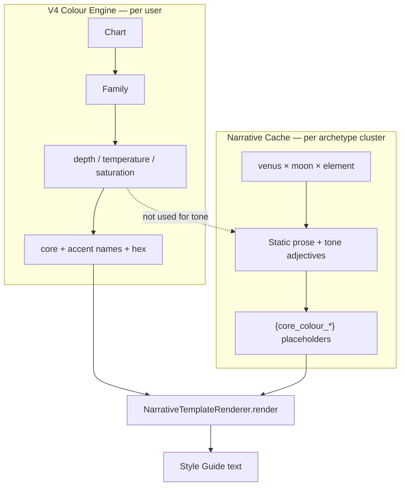
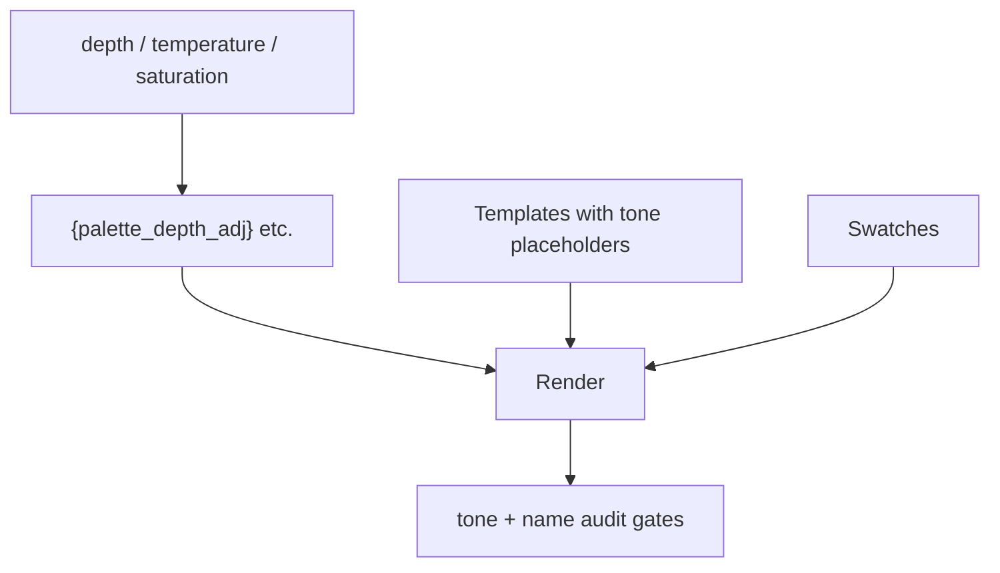

# Palette Placeholder Pass — Full Handoff

**Date:** 2026-06-22  
**Audience:** AI developer or engineer continuing Style Guide colour + narrative coherence work  
**Repo:** `/Users/ash/dev/mobile_apps/cosmicfit`  
**Status:** **Shipped (core fix)** — palette *names* in pattern/hardware now match V4 swatches. **Not complete** for palette *tone* coherence (earthy/pastel/watery adjectives vs actual palette profile).

**Related handoffs:**
- [`colour_name_rename_handoff.md`](colour_name_rename_handoff.md) — display-name refactor (separate track)
- [`style_guide_midheaven_gap_handoff.md`](style_guide_midheaven_gap_handoff.md) — MC/Moon depth in colour engine (separate track)

---

## 1. Executive summary

### The bug we fixed

Style Guide **Pattern Tip**, **Pattern Narrative**, and **Hardware** sections were rendering hardcoded editorial colour names (`burnt sienna`, `cobalt blue`, `fire red`, etc.) that came from legacy Venus-sign dataset associations — **not** from the user's V4 palette. The Palette screen showed e.g. powder blue while Pattern Tip said cobalt blue.

### What we did

Replaced hardcoded palette colour **names** in `blueprint_narrative_cache.json` with `{core_colour_*}` / `{accent_colour_*}` placeholders so `BlueprintComposer.compose` resolves them from the same V4 context as the swatches. Added audit tooling, content-audit guard, engine version bump (`2.1.0`), auto-recompose on launch, and coherence tests.

### What we deliberately did *not* fix

Templates still contain hardcoded **tone adjectives** (`earthy`, `sun-baked`, `watery`, `pastel`, `saturated`, etc.) that can contradict the user's actual palette depth/temperature. Example after the fix:

> *"Seek out warm, sun-baked colours like **powder blue** or **dusty rose**…"*

Colour **names** are correct; **prose tone** may still feel wrong. That is the main remaining product gap.

---

## 2. How the colour factoring work fits together

Understanding this is essential before tackling tone coherence.

### 2.1 Two-layer model (names vs tone)

| Layer | What it is | Where it lives | Status after this pass |
|-------|-----------|----------------|------------------------|
| **Palette factoring (V4 engine)** | Chart → family, variables, template hexes, accent slots → swatch names | `ColourEngineV4`, `BlueprintComposer.buildV4PaletteSection` | Unchanged; already per-user |
| **Narrative factoring (templates)** | Archetype cluster → 16 pre-written paragraphs | `blueprint_narrative_cache.json` | **Names** now wired to V4; **tone words** still static |

These were **decoupled** until this pass. We re-coupled **colour name tokens only**.

### 2.2 V4 palette pipeline (production compose)

```
Natal chart
  → ChartAnalyser
  → BlueprintTokenGenerator + DeterministicResolver (metals, stones, patterns, legacy resolver colours)
  → ColourEngine.evaluateProduction (V4)
       → PaletteFamily + DerivedVariables (depth, temperature, saturation, contrast, surface)
       → PaletteLibrary template bands (neutrals, core, accent, support, anchors)
       → Chart signatures + AccentResolver slots (chart-derived accent hex + displayName)
  → BlueprintComposer.composeFull
       → NarrativeCacheLoader.lookup(archetype cluster key)
       → buildContext(resolved)           // metals, stones, patterns, textures
       → buildV4PaletteContext(colourResult)  // core_colour_1..4, accent_colour_1..2,
       │                                         family, cluster, depth, temperature, …
       → merge contexts (V4 wins on colour keys)
       → NarrativeTemplateRenderer.render() for each Group B section
       → CosmicBlueprint persisted (engineVersion 2.1.0)
```

**Key files:**
- `Cosmic Fit/InterpretationEngine/BlueprintComposer.swift` — orchestration, `engineVersion`, accent label dedup
- `Cosmic Fit/InterpretationEngine/NarrativeTemplateRenderer.swift` — placeholder render + `buildV4PaletteContext`
- `Cosmic Fit/InterpretationEngine/NarrativeCacheLoader.swift` — one entry per archetype cluster (~576 keys)
- `data/style_guide/blueprint_narrative_cache.json` — template source (symlinked into app bundle)

### 2.3 Placeholder vocabulary (Group B)

**Sections now using V4 colour placeholders** (in addition to existing metal/stone/pattern/texture placeholders):

| Section | Placeholders |
|---------|-------------|
| `pattern_tip` | `{core_colour_1..4}`, `{accent_colour_1..2}`, `{recommended_pattern_*}`, `{avoid_pattern_*}` |
| `pattern_narrative` | same |
| `hardware_metals` | same + `{metal_*}` |
| `hardware_stones` | same + `{stone_*}` |
| `hardware_tip` | same + `{metal_*}`, `{stone_*}` |
| `palette_narrative` | colour placeholders only (already had them) |

**Already available but unused for tone:** `buildV4PaletteContext` also exposes `{family}`, `{cluster}`, `{depth}`, `{temperature}`, `{saturation}`, `{contrast}`, `{surface}`. No template uses these today for adaptive adjectives.

### 2.4 Archetype selection (why one paragraph ≠ one user palette)

Narratives are keyed by **`venus_{sign}__moon_{sign}__{element}_dominant`** (with fallback nearest-match). That is **chart personality**, not **palette family**.

A single cluster serves users whose V4 output may be:
- Soft Summer (cool, light, muted)
- Deep Autumn (warm, deep, rich)
- Bright Winter (cool, high contrast)

…with the **same** `pattern_tip` prose skeleton. Placeholders fix **which names** appear; they do **not** fix **which adjectives** appear.

### 2.5 What “complete” means for this pass

| Criterion | Done? |
|-----------|-------|
| Hardcoded palette **colour names** removed from 5 Group B sections | ✅ 0 audit violations |
| Rendered names match `palette.coreColours` / `accentColours` | ✅ tested (Romford regression) |
| Backfill prompts guard against new literals | ✅ |
| Content audit regression check | ✅ `hardcoded_palette_colour_in_group_b` |
| Existing users get fresh compose | ✅ `engineVersion` 2.1.0 + delete on mismatch |
| Tone adjectives match palette profile | ❌ out of scope |
| Production-audit blueprint fixture regen | ❌ deferred |
| CI runs audit script automatically | ❌ not wired |
| Supabase pull respects engine version | ❌ not wired |

---

## 3. What was shipped (file checklist)

| Artifact | Purpose |
|----------|---------|
| `tools/audit_narrative_palette_literals.py` | Lexicon scan; JSON/MD report; exit 1 on violations; `--suggest` |
| `data/style_guide/narrative_palette_literal_audit.{json,md}` | Latest clean audit output |
| `data/style_guide/blueprint_narrative_cache.json` | ~134 sections edited; 8 follow-up partial literals fixed (`ochre`, `cobalt`, `sienna`, `siennas`) |
| `tools/backfill_narratives.py` | Extended allowed placeholders + prompts for 5 sections |
| `tools/content_audit_checks.py` | `check_hardcoded_palette_colour_in_group_b` |
| `Cosmic Fit/InterpretationEngine/BlueprintComposer.swift` | `engineVersion = "2.1.0"` |
| `Cosmic Fit/UI/ViewControllers/CosmicFitTabBarController.swift` | Delete stale blueprint before compose |
| `Cosmic FitTests/NarrativePaletteCoherence_Tests.swift` | Romford regression + placeholder fidelity |

**Verification commands:**
```bash
python3 tools/audit_narrative_palette_literals.py   # expect exit 0
xcodebuild test -scheme "Cosmic Fit" \
  -destination 'platform=iOS Simulator,name=iPhone 16' \
  -only-testing 'Cosmic FitTests/NarrativePaletteCoherence_Tests'
```

---

## 4. Out of scope — and how to fix each

### 4.1 Editorial tone vs palette profile (PRIMARY FOLLOW-UP)

#### Problem

Templates embed **static tone adjectives** that describe colour *character*, not colour *names*. After placeholder pass, users can see contradictions like:

- *"rich, **earthy** solids like {core_colour_1}"* → core is **powder blue**
- *"**sun-baked** warmth"* → palette is **Soft Summer**
- *"**watery**, nostalgic tones"* in hardware stones → user has **Deep Autumn** cores

**Scale (approximate, current cache):**

| Tone word | Occurrences (palette + pattern + hardware) |
|-----------|---------------------------------------------|
| `saturated` | ~141 |
| `watery` | ~62 |
| `muted` | ~58 |
| `earthy` | ~57 |
| `icy` | ~52 |
| `luminous` | ~26 |
| `pastel` | ~14 |
| `sun-baked` | ~12 |
| `deep tones` | ~9 |

Hardware stones carry the heaviest tone load (`watery` ×52, `earthy` ×32) because gem prose often describes optical character — some of that is intentional (stone appearance, not wardrobe), but garment-adjacent phrases still clash.

#### Recommended approach (phased)

**Do not** solve this by banning English adjectives globally. **Do** treat tone like we treated colour names: derive or select from the user's palette profile.

##### Phase A — Taxonomy + audit (1–2 days)

1. Define a **tone lexicon** mapped to V4 `DerivedVariables`:
   - `depth`: light / medium / deep → adjective pools (`soft`, `airy`, `pastel-leaning` vs `rich`, `earthy`, `deep`)
   - `temperature`: warm / cool / neutral → (`sun-baked`, `golden` vs `icy`, `watery`, `steel-cool`)
   - `saturation`: muted / rich / bright → (`muted`, `dusty` vs `saturated`, `high-voltage`)
2. Add `tools/audit_narrative_tone_coherence.py`:
   - Input: cache + optional composed blueprint fixtures
   - Flag sentences where tone word **conflicts** with resolved `{depth}`/`{temperature}`/`{saturation}` for that user profile
   - Output: violation list per cluster + section
3. Extend `content_audit_checks.py` with `tone_adjective_palette_mismatch` (warn, not block initially).

##### Phase B — Placeholder-based tone (preferred long-term)

Replace hardcoded tone adjectives with **derived placeholders**, same pattern as colour names:

| New placeholder | Derived from | Example output |
|-----------------|-------------|----------------|
| `{palette_depth_adj}` | `variables.depth` | deep → "rich, earthy" · light → "soft, airy" |
| `{palette_temp_adj}` | `variables.temperature` | warm → "sun-warmed" · cool → "cool, crisp" |
| `{palette_sat_adj}` | `variables.saturation` | muted → "muted, dusty" · rich → "saturated, lush" |
| `{core_colour_quality}` | LCH of core slot 1 | optional fine-grain (advanced) |

Implement in `NarrativeTemplateRenderer.buildV4PaletteContext` (or a sibling `buildV4ToneContext`) using a small lookup table — **no LLM at runtime**.

**Template edit pattern:**
```diff
- Seek out warm, sun-baked colours like {core_colour_1} or {core_colour_2}
+ Seek out {palette_temp_adj} colours like {core_colour_1} or {core_colour_2}
```

**Pros:** Deterministic, per-user, testable, no selection architecture change.  
**Cons:** Requires editorial pass on ~200–400 sentences; adjective pools need human QA.

##### Phase C — Template variants per palette profile (alternative/complement)

If placeholder tone feels too generic, split high-traffic clusters into **variants**:

```
venus_scorpio__moon_capricorn__fire_dominant
  pattern_tip_warm_deep
  pattern_tip_cool_light
  pattern_tip_neutral_medium   // default fallback
```

At compose time, select variant from `colourResult.variables` (decision tree on depth × temperature).

**Pros:** Best prose quality; writers control voice fully per profile.  
**Cons:** 3× content volume for affected sections; backfill cost; fallback logic in `NarrativeCacheLoader`.

##### Phase D — Runtime sentence gating (surgical, not comprehensive)

For **specific** high-conflict patterns only, skip or swap sentences at render time:

```swift
// Pseudocode — after placeholder render
if colourResult.variables.depth == .light && sentenceContains("earthy") {
    useAlternateSentenceOrStripAdjective()
}
```

**Pros:** Fast fix for worst offenders.  
**Cons:** Fragile regex maintenance; doesn't scale to 57× "earthy" instances; easy to break grammar.

##### Phase E — Conditional paragraph selection (middle ground)

Tag each section string (or sentence) with **requirements** in sidecar metadata:

```json
"pattern_tip": {
  "text": "…earthy… {core_colour_1}…",
  "requires": { "depth": ["deep", "medium"], "temperature": ["warm", "neutral"] }
}
```

At compose, filter sentences or whole sections that fail requirements; fall back to a neutral template.

**Pros:** Keeps writer voice; avoids showing "earthy" to Soft Summer users.  
**Cons:** Needs metadata for hundreds of paragraphs; neutral fallbacks must exist.

#### Recommendation

| Priority | Approach |
|----------|----------|
| **P0** | Phase A audit — quantify clashes per real user fixtures (Romford, Ash, Maria, 3 synth profiles) |
| **P1** | Phase B tone placeholders for **pattern_tip + pattern_narrative** (smallest surface, highest user visibility) |
| **P2** | Phase B for palette_narrative (already has colour placeholders; tone clash most visible here) |
| **P3** | Phase E for hardware_stones gem-optical prose (keep "watery" for opal contexts; gate garment-adjacent phrases only) |
| **Defer** | Phase C full variant matrix unless product wants premium editorial investment |

#### Acceptance criteria (tone pass)

- [ ] No `earthy` / `sun-baked` / `deep tones` in rendered output when `variables.depth == .light`
- [ ] No `pastel` / `watery` / `airy` when `variables.depth == .deep && temperature == .warm`
- [ ] Romford (or known Soft Summer profile): pattern tip contains no warm-deep adjectives
- [ ] Deep Autumn synth profile: pattern tip may use earthy language
- [ ] Audit script exits 0 on tone rules (new gate, separate from colour literal gate)

---

### 4.2 Full production-audit blueprint fixture regen

**Deferred:** `docs/fixtures/production_audit/blueprints/*.json` (~hundreds of files).

Those fixtures snapshot full composed blueprints for audit/review. Narrative fields (`pattern.tipText`, etc.) still contain **pre-pass frozen prose** for users composed before cache edit — misleading for regression review but **not** user-facing unless someone reads fixtures literally.

**Fix when needed:**
```bash
REGENERATE_BLUEPRINT_FIXTURES=1 swift test --filter FixtureRegeneration
# For production_audit set — check tools/content_audit.py sources and any dedicated regen script
```

**Smaller fixtures** (`docs/fixtures/blueprint_input_user_*.json`) can be regen'd the same way; not done in this pass.

---

### 4.3 Supabase stale blueprint paths

**Known gap:** `engineVersion` check runs in `CosmicFitTabBarController.generateContent()` only.

**Not guarded:**
- `hydrateBlueprint()` — saves remote blueprint without version check
- `SupabaseSyncService.performFullSync()` — pulls remote when local nil

**Risk:** Reinstall / new device may briefly load remote `2.0.0` blueprint with old frozen prose until next launch path deletes it.

**Fix:**
```swift
// Before BlueprintStorage.shared.save(remote) in hydrate + full sync:
if remote.engineVersion != BlueprintComposer.engineVersion {
    // Prefer local recompose over stale remote
    generateAndPersistBlueprint()
    return
}
```

Also push recomposed `2.1.0` blueprint after local regen so remote converges.

---

### 4.4 CI / pre-release gate for colour literal audit

**Not wired:** `python3 tools/audit_narrative_palette_literals.py` is manual only.

**Fix:** Add to release checklist or CI step (alongside `content_audit.py --sources cache`).

Optional: XCTest shell-out wrapper (plan mentioned as optional).

---

### 4.5 Inspector spot-check

Plan Phase 6: Romford profile in Inspector — pattern tip names match Core Palette.

**Not documented as executed.** Recommended before calling tone pass "done":
- Inspector → Dec 21 1964 Romford → Pattern Tip + Hardware vs Palette swatch names

---

### 4.6 Colour name rename (separate programme)

[`colour_name_rename_handoff.md`](colour_name_rename_handoff.md) covers **display label vs hex mismatch** (e.g. "Magenta Red" showing pink). That is **orthogonal** to placeholder pass:

| Workstream | Fixes |
|------------|-------|
| Placeholder pass | Narrative uses same **names** as swatches |
| Name rename | Names **match what hex looks like** to a shopper |

Both can be true while tone adjectives still clash. Phase 4 rename work may change swatch labels → narrative auto-follows via placeholders.

---

### 4.7 MC / Moon depth in colour engine

[`style_guide_midheaven_gap_handoff.md`](style_guide_midheaven_gap_handoff.md) — Midheaven absent from V4 input; Moon depth diluted. Would change **which** colours appear, not narrative template selection. Separate from placeholder pass; may reduce tone clashes for Scorpio MC / Taurus Moon profiles once depth overlays land.

---

### 4.8 Semantic copy in hardware stones (gem optical vs wardrobe)

Some `{accent_colour_1}` replacements sit in **gem optical** sentences:

> *"{stone_1} shifts between {accent_colour_1} and silver depending on the light"*

Here `{accent_colour_1}` is a **stand-in for flash colour**, not a wardrobe recommendation. Acceptable for palette name consistency; tone pass should **exclude** optical gem descriptions from garment tone rules (same allowlist pattern as metal-finish phrases in literal audit).

---

## 5. Architecture diagram (current vs target)

### Today (after placeholder pass)



### Target (tone coherence pass)



---

## 6. Decision log (for future implementers)

| Decision | Rationale |
|----------|-----------|
| Placeholders for **names**, not full sentence regen | Minimal diff; reuses existing Group B render path; same mechanism as `palette_narrative` |
| Accept tone mismatch temporarily | Product priority was wrong **colour names** (user-reported bug); tone is broader editorial programme |
| `engineVersion` bump vs schema wipe | Forces recompose without invalidating unrelated persisted fields |
| Hardcoded lexicon vs `colour_library` scan | Editorial literals were a closed set; partial forms (`ochre`, `cobalt`) added after first audit false negative |
| One paragraph per cluster | Existing WP3 architecture; changing it is a multi-sprint narrative project |

---

## 7. Suggested next POR

**Title:** Palette tone coherence — adaptive adjectives for Group B narratives

**Scope:** Phase A audit + Phase B tone placeholders for `pattern_tip`, `pattern_narrative`, `palette_narrative`; Supabase version gate; CI audit step.

**Out of scope:** Full cluster variant matrix; production_audit mass regen unless audit team requests.

---

## 8. Quick reference — who owns what

| Symptom | Likely cause | Fix track |
|---------|-------------|-----------|
| Wrong colour **name** in Pattern Tip | Stale saved blueprint or missed literal in cache | Placeholder pass (done) + audit |
| "**Earthy**" but palette is pastel | Static tone adjective | Tone placeholder pass (§4.1) |
| Name doesn't match **hex appearance** | Internal label vs shopper language | Name rename handoff |
| Palette lacks depth for MC chart | V4 engine input gap | MC/Moon handoff |
| Old prose after app update | Supabase pull / no version gate | §4.3 |

---

*End of handoff.*
