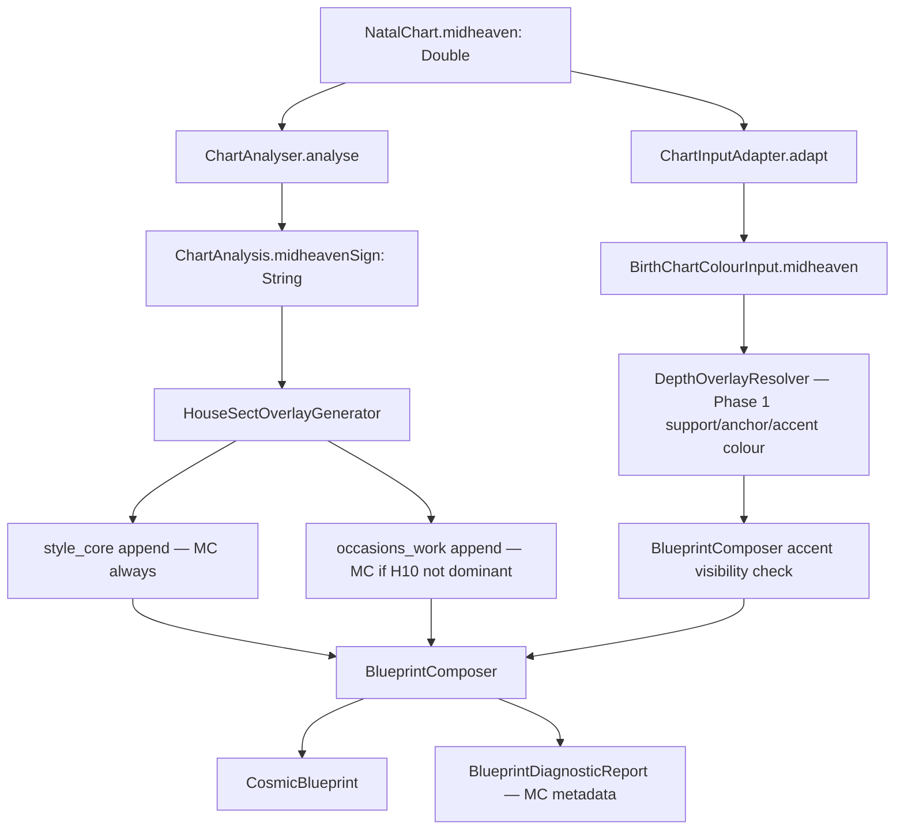

# Style Guide Midheaven Phase 2 — Implementation Plan

**Status:** Ready for implementation  
**Date:** 2026-06-09  
**Audience:** AI developer with full context window  
**Prerequisite doc:** `docs/handoff/style_guide_midheaven_gap_handoff.md` (discovery + scope rationale)  
**Depends on:** Colour palette Phase 1 (V4.7 MC/Moon depth overlay, including conditional accent injection) — already implemented locally

---

## 1. Executive Summary

### Problem

The Style Guide colour palette now supports Midheaven (MC) influence via `DepthOverlayResolver` (V4.7). The **rest of the Style Guide** still has no MC sign signal. A user with Scorpio MC can receive Soft Summer colours with added depth (Phase 1) but Style Core and Work occasions text will not reflect Scorpio public-image qualities unless other chart factors happen to route similar language.

### Goal

Add **deterministic MC sign overlays** to the broader Style Guide narrative pipeline, without changing archetype cluster keys or family classification.

### Success criteria (definition of done)

1. `ChartAnalysis` exposes `midheavenSign` derived from `NatalChart.midheaven`.
2. `HouseSectOverlayGenerator` appends MC overlay text to:
   - **Style Core** (always)
   - **Work occasions** (when house 10 is not already dominant — dedup guard)
3. Narrative cluster keys remain `venus_{sign}__moon_{sign}__{element}_dominant` — **no MC in `ArchetypeKeyGenerator`**.
4. Phase 2 narrative work does **not** modify `ColourEngineV4/*`; family, neutrals, and core colours remain stable. Support, deep-anchor, and accent depth changes from Phase 1 are accepted baseline behavior.
5. Unit tests cover MC overlay routing, jargon-freedom, deduplication, and `ChartAnalyser` MC derivation.
6. House/sect regression fixtures regenerated; Inspector rebuilt; preset profiles manually reviewed.
7. `BlueprintDiagnosticReport` exposes MC sign + overlay-applied flag for Inspector drill-down.

### What this plan does NOT do

| Out of scope | Reason |
|---|---|
| MC in `ArchetypeKeyGenerator` | Keyspace explosion (6,912 keys) |
| MC in Textures, Hardware, Patterns | Lower impact; existing Venus/Moon/house/sect signals sufficient |
| MC as `DriverKey` / family scoring weight | Phase 1 explicitly post-family overlay only |
| Changes to `SemanticTokenGenerator` | Separate legacy token path; not production Style Guide |
| PDF export | No in-repo PDF pipeline; Inspector exports Markdown only |

---

## 2. Current State (Baseline)

### Phase 1 complete — Colour Engine V4.7 MC/Moon depth overlay

| Component | Status | File |
|---|---|---|
| `BirthChartColourInput.midheaven` | ✅ Done | `ColourEngineV4/Domain.swift` |
| MC adaptation from natal chart | ✅ Done | `ColourEngineV4/ChartInputAdapter.swift` |
| Support/deep-anchor depth overlay | ✅ Done | `ColourEngineV4/DepthOverlayResolver.swift` |
| Conditional accent depth injection | ✅ Done | `ColourEngineV4/DepthOverlayResolver.swift` |
| Pipeline steps 11c + post-accent injection | ✅ Done | `ColourEngineV4/ColourEngine.swift` |
| Inspector trace `depthOverlay` | ✅ Done | `BlueprintDiagnostics.swift` |
| Unit tests, including accent injection cases | ✅ Done | `DepthOverlayResolver_Tests.swift` |

MC is **not** a weighted driver. It does not affect family classification. Phase 1 now applies across three palette surfaces: support, deep anchor, and a conditional contrast accent.

### 2b. Phase 1 Actual State (post-iteration, 2026-06-09)

The original conservative pass only substituted one support colour and, for shallow families, the deep anchor. Manual review showed that was technically correct but still visually conservative: depth landed in supporting infrastructure while the visible accent band could remain dusty and mid-value. The final Phase 1 behavior adds conditional accent injection so the moody public-image note can appear where users actually notice it.

#### Palette surfaces now affected

| Layer | When it runs | What changes | Zendaya-like outcome |
|---|---|---|---|
| Support overlay | Step 11c, before accents | Last support slot | `camel` → `oxblood` |
| Deep anchor overlay | Step 11c | Deep anchor on shallow families | `muted charcoal` → `bitter chocolate` |
| Accent depth injection | After `AccentResolver` | One contrast accent if the band is all light | e.g. `Rose Madder` → Scorpio dark accent |

#### Colour pipeline order

```text
family
→ template
→ winter-compression
→ DepthOverlayResolver.resolve()
→ AccentResolver
→ DepthOverlayResolver.injectAccentDepth()
→ final palette
```

#### Support / anchor activation rules

- Family must **not** already be deep: `Deep Autumn`, `Deep Winter`, `True Winter`, `Bright Winter`.
- MC or Moon must be in `{Scorpio, Taurus, Capricorn, Cancer, Pisces}`.
- MC is ranked above Moon with a `1.1x` strength multiplier.
- Support uses semantic candidate order, not maximum difference from existing support.
- Scorpio support candidates prioritize `oxblood` first.
- Taurus support candidates prioritize `bitter chocolate` first.
- Anchor substitution only applies on shallow families.
- If MC owns support, Moon can own anchor. This is the desired Zendaya-like behavior: Scorpio MC support plus Taurus Moon anchor.

#### Accent injection activation rules

- The support/anchor overlay must already have applied.
- MC must be one of `{Scorpio, Capricorn, Taurus}`. Cancer/Pisces do not trigger accent injection.
- No existing accent may have lightness `L < 40`.
- The resolver replaces the last accent slot with the darkest MC sign expression from `SignAccentExpressions`.
- Product decision: moody punch belongs in accents, not only in support or anchors.

#### Diagnostic shape

The colour trace now conceptually includes:

```swift
OverlayResult {
    supportSubstitution
    deepAnchorSubstitution
    accentDepthInjection
    applied
}
```

`BlueprintDiagnosticReport.depthOverlay` is the colour trace. The Inspector response JSON carries it, but the current Inspector web UI still does **not** fully render `depthOverlay` in `app.js`. Treat UI rendering as a follow-up unless it has already been fixed by the time this handoff is used.

#### Fixture churn already caused by Phase 1

Phase 1 intentionally changed some palette outputs:

- Support/deep-anchor for depth-sign charts.
- Accent hexes for a small fixture subset in `docs/fixtures/v4_dataset.json`, including `U040`, `U045`, `U051`, and `U053`.

Current regression gates lock neutrals, core, and accent hex arrays in `v4_dataset.json`. Do not assume pre-MC palette fixtures are still valid.

#### Known Phase 1.5 follow-up: accent injection visibility

There is a likely wiring gap to verify before or during Phase 2:

`ColourEngine` can write injected accent hexes into `palette.accentColours`, but `BlueprintComposer.buildV4PaletteSection()` still builds the visible accent band from `accentSlots[].hex` when slots exist. That means accent injection may be computed and traced but not always visible in the Style Guide UI or Inspector.

Before validating Zendaya-like output, ensure one of these is true:

- `BlueprintComposer` uses the injected hex/name for the affected accent slot when `depthOverlay.accentDepthInjection` is present.
- Or `ColourEngine` syncs `accentSlots` after injection so `BlueprintComposer` naturally emits the injected accent.

Without this, a profile can correctly receive `oxblood` support and `bitter chocolate` deep anchor while still displaying two dusty mid-value accents.

### Phase 2 gap — Narrative pipeline

| Component | Status | Gap |
|---|---|---|
| `ChartAnalysis.midheavenSign` | ❌ Missing | MC not on analysis struct |
| `HouseSectOverlayGenerator` MC overlay | ❌ Missing | No sign-based public-image text |
| `ArchetypeKeyGenerator` | ✅ Unchanged (intentional) | Venus/Moon/element only |
| `BlueprintDiagnosticReport` MC metadata | ❌ Missing | Inspector can't show MC overlay status for narrative |

### Production Style Guide pipeline (entry point)

```
NatalChart
  → ChartAnalyser.analyse() → ChartAnalysis
  → ChartInputAdapter.adapt() → BirthChartColourInput (has midheaven)
  → ColourEngine.evaluateProduction() → palette + depthOverlay
  → BlueprintTokenGenerator.generate() → tokens
  → DeterministicResolver.resolveNonPalette() → textures/hardware/patterns/code
  → ArchetypeKeyGenerator.generateKey() → venus__moon__element key
  → NarrativeCacheLoader.lookup() → 16 section narratives
  → HouseSectOverlayGenerator.generate() → append strings
  → NarrativeTemplateRenderer.render() → Group B placeholders only
  → BlueprintComposer → CosmicBlueprint
```

**Key file:** `Cosmic Fit/InterpretationEngine/BlueprintComposer.swift` — `composeFull(...)` is the single entry point.

### Overlay append mechanism (existing)

`BlueprintComposer` appends overlay text with `\n\n` separator:

```swift
if let append = overlays.styleCoreAppend {
    narrativesMut["style_core"] = (narrativesMut["style_core"] ?? "") + "\n\n" + append
}
if let append = overlays.occasionsWorkAppend {
    narrativesMut["occasions_work"] = (narrativesMut["occasions_work"] ?? "") + "\n\n" + append
}
```

Style Core and Occasions are **Group A** sections — pure prose, no `{placeholder}` rendering.

---

## 3. Implementation Steps

Execute in order. Step 0 should be verified before user-facing validation, because otherwise the colour trace can show accent injection while the Style Guide UI still displays the pre-injection accent slot. Steps 3 and 4 can run in parallel after Step 2.

---

### Step 0: Verify Phase 1.5 accent injection visibility

**File:** `Cosmic Fit/InterpretationEngine/BlueprintComposer.swift`

Before implementing narrative MC overlays, verify whether `BlueprintComposer.buildV4PaletteSection()` displays the injected accent when `DepthOverlayResolver.injectAccentDepth()` has replaced an accent. The likely issue is:

- `ColourEngine` writes the injected accent into `colourResult.palette.accentColours`.
- `BlueprintComposer.buildV4PaletteSection()` uses `colourResult.accentSlots[].hex` when slots exist.
- Therefore, the injected accent may be present in the final palette model but not visible in the Style Guide accent band.

Acceptance criteria:

- [ ] A profile with `depthOverlay.accentDepthInjection != nil` displays the injected accent hex/name in `PaletteSection.accentColours`.
- [ ] The Inspector Style Guide palette and JSON response agree.
- [ ] Existing non-injected accent provenance remains intact.

Implementation options:

1. Update `BlueprintComposer` to use the injected hex/name for the affected accent slot when `depthOverlay.accentDepthInjection` is present.
2. Or update `ColourEngine` to sync `accentSlots` after injection so downstream code does not need special handling.

Prefer the smaller change that preserves current accent provenance and avoids touching family scoring.

---

### Step 1: Add `midheavenSign` to `ChartAnalysis`

**File:** `Cosmic Fit/InterpretationEngine/ChartAnalyser.swift`

#### 1a. Extend struct

Add one field to `ChartAnalysis`:

```swift
struct ChartAnalysis: Equatable {
    // ... existing fields ...
    let midheavenSign: String
}
```

Do **not** add `midheavenDegree` unless a downstream consumer needs it in this phase. Degree is already available on `BirthChartColourInput.midheaven.degree` via `ChartInputAdapter`. Keeping `ChartAnalysis` minimal reduces test churn.

#### 1b. Derive in `analyse(chart:)`

Inside `ChartAnalyser.analyse(chart:)`, after `ascSign` is computed:

```swift
let midheavenSign = signName(for: chart.midheaven)
```

Pass into `ChartAnalysis(...)` initializer.

Use the existing public helper — do **not** duplicate the sign-index array from `ChartInputAdapter`:

```swift
static func signName(for longitude: Double) -> String {
    let signIndex = CoordinateTransformations.decimalDegreesToZodiac(longitude).sign
    return CoordinateTransformations.getZodiacSignName(sign: signIndex)
}
```

#### 1c. Acceptance criteria

- [ ] `ChartAnalyser.analyse(chart:)` populates `midheavenSign` for any valid `NatalChart`.
- [ ] MC sign matches `ChartInputAdapter` MC sign for the same chart (consistency check).
- [ ] Project compiles after updating all `ChartAnalysis(` construction sites.

#### 1d. Test construction sites to update

Search: `ChartAnalysis(` across the repo.

**Primary file:** `Cosmic FitTests/Cosmic_FitTests.swift`

Helpers that construct `ChartAnalysis` manually (all need `midheavenSign:`):

| Helper | Approx. line | Suggested default |
|---|---|---|
| `makeStubAnalysis(...)` | ~601 | `"Capricorn"` or contextually appropriate |
| `makeAnalysis(venusHouse:moonHouse:sect:...)` | ~873 | `"Cancer"` (HouseSectIntegrationTests) |
| `makeOverlayCoverageAnalysis(...)` | ~1169 | Derive from `primaryHouse` if 10, else `"Aries"` |
| `makeAnalysis(user: SyntheticUser)` | ~1622 | Add `midheavenSign` to `SyntheticUser` or hardcode |

Only `ChartAnalyser.swift` and `Cosmic_FitTests.swift` contain `ChartAnalysis(` constructions in production code paths. Grep to confirm no others were added since this plan was written.

#### 1e. New unit test

Add to `Cosmic_FitTests.swift` (or a focused test struct):

```swift
@Test("ChartAnalyser exposes midheavenSign from natal chart")
func chartAnalyserMidheavenSign() {
    // Build synthetic chart with known MC longitude
    // e.g. midheaven = 210.0 → Scorpio (sign index 8, 210/30 = 7 → Scorpio is index 8? verify with CoordinateTransformations)
    let chart = syntheticChart(ascendant: 180.0, longitudes: [...])
    let analysis = ChartAnalyser.analyse(chart: chart)
    #expect(analysis.midheavenSign == "Scorpio") // adjust for actual longitude
}
```

Use existing `syntheticChart(ascendant:longitudes:)` helper in `Cosmic_FitTests.swift` (~line 1198). Note: that helper sets `midheaven = normalizeAngle(ascendant + 90.0)` — for ascendant 180°, MC = 270° → Capricorn (verify).

---

### Step 2: Add MC overlay to `HouseSectOverlayGenerator`

**File:** `Cosmic Fit/InterpretationEngine/HouseSectOverlayGenerator.swift`

#### 2a. Design principles

Follow existing overlay conventions:
- **Jargon-free:** no house numbers, planet names, "Midheaven", "MC", zodiac sign names in user-facing text
- **Deterministic:** static sign → text lookup, no AI, no dataset dependency
- **Secondary signal:** MC shapes public-image polish; does not override Venus/Moon narrative cluster
- **Short:** one sentence per section, matching Venus/sect overlay length

#### 2b. Add private generator method

```swift
private static func generateMidheavenOverlay(
    analysis: ChartAnalysis
) -> (styleCore: String, work: String?) {
    let sign = analysis.midheavenSign
    guard let styleCoreText = midheavenStyleCoreText(for: sign) else {
        return (styleCore: "", work: nil)
    }
    let workText = midheavenWorkText(for: sign)
    return (styleCore: styleCoreText, work: workText)
}
```

#### 2c. Sign → text lookup tables

Add two private static dictionaries or switch statements. **Do not** reuse `AstrologicalInterpreter.interpretMidheaven` text — that is career-focused, jargon-heavy ("Midheaven in Scorpio"), and wrong tone for Style Guide.

**Style Core templates** (public-facing style identity — always appended):

| Sign | Text |
|---|---|
| Aries | Your public style reads as bold and decisive; you make strong first impressions without trying too hard. |
| Taurus | Your public style reads as quietly luxurious; tactile quality and understated expense signal before you speak. |
| Gemini | Your public style reads as versatile and expressive; you communicate range and adaptability through what you wear. |
| Cancer | Your public style reads as warm and approachable; polished comfort signals care and emotional intelligence. |
| Leo | Your public style reads as radiant and confident; generous presence and visible polish are your natural mode. |
| Virgo | Your public style reads as refined and precise; quiet excellence and immaculate detail speak louder than flash. |
| Libra | Your public style reads as harmonious and elegant; social grace and balanced aesthetics are immediately legible. |
| Scorpio | Your public style reads as magnetic and controlled; depth, intensity, and polished restraint draw people in. |
| Sagittarius | Your public style reads as bold and expansive; globally informed choices and adventurous scope signal confidence. |
| Capricorn | Your public style reads as structured and authoritative; timeless polish and investment-grade quality define your image. |
| Aquarius | Your public style reads as distinctive and forward-thinking; modern edge and independent taste set you apart. |
| Pisces | Your public style reads as fluid and intuitive; soft elegance and imaginative beauty feel effortlessly composed. |

**Work occasion templates** (professional styling — conditionally appended):

| Sign | Text |
|---|---|
| Aries | At work, lean into direct confidence; structured pieces and clean lines reinforce your natural authority. |
| Taurus | At work, lean into quality and permanence; investment pieces and rich textures signal reliability and taste. |
| Gemini | At work, lean into adaptability; polished separates and communication-friendly styling keep you agile. |
| Cancer | At work, lean into approachable authority; soft structure and nurturing polish build trust without sacrificing presence. |
| Leo | At work, lean into commanding warmth; statement pieces with generous polish project leadership naturally. |
| Virgo | At work, lean into meticulous polish; impeccable tailoring and refined detail communicate competence instantly. |
| Libra | At work, lean into diplomatic elegance; balanced proportions and harmonious palettes support collaborative authority. |
| Scorpio | At work, lean into powerful restraint; deep tones, controlled intensity, and impeccable finish command respect quietly. |
| Sagittarius | At work, lean into expansive confidence; globally inspired pieces and bold scope signal vision and ambition. |
| Capricorn | At work, lean into structured authority; timeless tailoring and investment-grade workwear build lasting credibility. |
| Aquarius | At work, lean into distinctive innovation; unconventional polish and forward-thinking choices signal original leadership. |
| Pisces | At work, lean into empathetic fluidity; soft structure and creatively composed pieces communicate intuitive intelligence. |

Implement as:

```swift
private static func midheavenStyleCoreText(for sign: String) -> String? {
    switch sign {
    case "Aries": return "Your public style reads as bold and decisive; ..."
    // ... all 12 signs
    default: return nil
    }
}

private static func midheavenWorkText(for sign: String) -> String? {
    switch sign {
    // ... all 12 signs
    default: return nil
    }
}
```

#### 2d. Wire into `generate(analysis:dataset:)`

After existing overlay generation, add MC logic:

```swift
let mcOverlay = generateMidheavenOverlay(analysis: analysis)

// Style Core: append MC after Venus + sect combination
if !mcOverlay.styleCore.isEmpty {
    if let existing = styleCoreAppend {
        styleCoreAppend = existing + " " + mcOverlay.styleCore
    } else {
        styleCoreAppend = mcOverlay.styleCore
    }
}

// Work occasions: append MC unless house 10 is already dominant (dedup guard)
if let workText = mcOverlay.work {
    let house10Dominant = analysis.houseEmphasis.dominantHouses.prefix(2).contains(10)
    if !house10Dominant {
        if let existing = occasionsWorkAppend {
            occasionsWorkAppend = existing + " " + workText
        } else {
            occasionsWorkAppend = workText
        }
    }
}
```

**Deduplication rationale:** When house 10 is in the top-2 dominant houses, `generateDominantHouseOverlay` already routes public-image language to `occasions_work` (via `"public"` domain). Adding MC work text would duplicate sentiment. Style Core MC append **always fires** — it's sign-quality language, not house-activity language.

#### 2e. Acceptance criteria

- [ ] Every sign produces non-empty Style Core MC text.
- [ ] Work MC text suppressed when `dominantHouses.prefix(2)` contains `10`.
- [ ] Work MC text present when house 10 is not dominant.
- [ ] All MC overlay strings pass existing jargon check (no "Scorpio", "Midheaven", "house", etc.).
- [ ] MC overlay is deterministic across 20 runs.
- [ ] `Overlays` struct unchanged — no new fields needed.

#### 2f. Zendaya validation case

From discovery doc — verify manually after implementation:

| Placement | Value |
|---|---|
| Sun | Virgo |
| Moon | Taurus |
| Ascendant | Aquarius |
| Midheaven | Scorpio |

Expected result:

| Check | Expected |
|---|---|
| Family | Soft Summer (unchanged) |
| Neutrals / core | Unchanged |
| Support | `oxblood` |
| Deep anchor | `bitter chocolate` from Taurus Moon, because Scorpio MC owns support |
| Accents | One soft accent plus one **dark** Scorpio note, e.g. Deep Plum or Garnet, not two dusty mids |
| Style Core append | Scorpio public-image sentence from Phase 2 |
| Work append | Scorpio work sentence unless H10 is dominant |

Lesson learned from Phase 1: the first implementation was technically correct but visually conservative because depth landed in support/anchor only. Accent injection was added after manual review because the accent band still read dusty.

---

### Step 3: Update `BlueprintComposer` debug diagnostics

**File:** `Cosmic Fit/InterpretationEngine/BlueprintComposer.swift`

In `#if DEBUG` block `logBlueprintDiagnostics`, section 8 "HOUSE/SECT OVERLAYS", add:

```swift
print("\(p) Midheaven sign: \(analysis.midheavenSign)")
```

No structural changes to compose pipeline.

---

### Step 4: Extend `BlueprintDiagnosticReport` for Inspector

**File:** `Cosmic Fit/InterpretationEngine/BlueprintDiagnostics.swift`

Diagnostics now have two separate tracks:

| Track | Field(s) | Status |
|---|---|---|
| Colour trace | `depthOverlay` with support, anchor, accent injection, `applied` | Already exists from Phase 1; verify shape includes accent injection |
| Narrative trace | `midheavenSign`, `midheavenOverlayApplied` | Phase 2 work |

Do not conflate these. `depthOverlay` describes palette behavior; the new fields describe MC narrative overlay behavior.

#### 4a. Add narrative fields

```swift
struct BlueprintDiagnosticReport: Codable, Equatable {
    let chartInput: BirthChartColourInput
    let boundaryFlags: [ChartInputAdapter.BoundaryFlag]
    let familyDecisionTrace: FamilyDecisionTrace
    let accentSlots: [AccentSlot]
    let depthOverlay: DepthOverlayResolver.OverlayResult
    let midheavenSign: String
    let midheavenOverlayApplied: Bool
}
```

`midheavenOverlayApplied` = true when MC text was appended to Style Core (always, if sign resolves) OR Work (when dedup guard allows). Simplest implementation: pass a bool from `HouseSectOverlayGenerator` or compute in `BlueprintComposer` by checking whether MC templates resolved.

#### 4b. Update `BlueprintDiagnostics.report(...)`

Add parameters:

```swift
static func report(
    from colourResult: ColourEngineResult,
    adaptedInput: ChartInputAdapter.AdaptedInput,
    midheavenSign: String,
    midheavenOverlayApplied: Bool
) -> BlueprintDiagnosticReport
```

#### 4c. Update `BlueprintComposer.composeFull`

```swift
let diagnostics = BlueprintDiagnostics.report(
    from: colourResult,
    adaptedInput: adapted,
    midheavenSign: analysis.midheavenSign,
    midheavenOverlayApplied: /* derive from overlays or overlay generator flag */
)
```

#### 4d. Inspector UI (optional but recommended)

**File:** `inspector/Sources/CosmicFitInspectorServer/Web/app.js`

In `buildBlueprintDiagnosticsAccordion(blueprintDiagnostics)`, add a row:

- Midheaven sign: `{midheavenSign}`
- MC narrative overlay: Applied / Not applied

This is a small JS change; skip only if time-constrained — the JSON will carry the fields regardless.

#### 4e. Backward compatibility

`BlueprintDiagnosticReport` is Codable. If any cached JSON lacks new fields, add custom `init(from decoder:)` with defaults:

```swift
midheavenSign = try container.decodeIfPresent(String.self, forKey: .midheavenSign) ?? ""
midheavenOverlayApplied = try container.decodeIfPresent(Bool.self, forKey: .midheavenOverlayApplied) ?? false
```

---

### Step 5: Tests

**Primary file:** `Cosmic FitTests/Cosmic_FitTests.swift` — extend `HouseSectIntegrationTests`

#### 5a. Required new tests

| Test name | Validates |
|---|---|
| `chartAnalyserMidheavenSign` | MC sign derived correctly from natal chart |
| `mcOverlayStyleCoreAlwaysPresent` | Scorpio MC → `styleCoreAppend` contains expected substring |
| `mcOverlayWorkPresentWhenH10NotDominant` | Scorpio MC, dominant houses [5, 7] → work append contains MC text |
| `mcOverlayWorkSuppressedWhenH10Dominant` | Scorpio MC, dominant houses [10, 5] → work append has no MC work sentence |
| `mcOverlayJargonFree` | Extend `overlayJargonCheck` jargon list: add `"Midheaven"`, `"MC"`, all 12 sign names |
| `mcOverlayDeterministic` | 20 runs identical for same analysis |
| `chartInputAdapterMidheavenMatchesChartAnalysis` | Same chart → adapter MC sign == analysis.midheavenSign |

#### 5b. Update existing tests

- All `makeAnalysis` / `makeStubAnalysis` / `makeOverlayCoverageAnalysis` helpers: add `midheavenSign` parameter with sensible default.
- `overlayJargonCheck`: ensure MC overlay text is included in `allOverlayTexts` scan.
- House/sect regression export test (`HardeningEdgeCaseTests`): will produce updated `input_after/*.json` — expected.

#### 5c. Tests that should NOT change output

- `DepthOverlayResolver_Tests.swift` — colour only; already includes support, anchor, and accent injection cases from Phase 1. Do not expand it unless Step 0 exposes a wiring gap that needs coverage.
- `ColourEngineV4_UnitTests.swift` — colour only; no Phase 2 narrative changes expected.
- `PaletteRework_Tests.swift` — palette provenance, untouched

#### 5d. Run command

```bash
cd /Users/ash/dev/mobile_apps/cosmicfit
xcodebuild test \
  -workspace "Cosmic Fit.xcworkspace" \
  -scheme "Cosmic Fit" \
  -destination 'platform=iOS Simulator,name=iPhone 16 Pro' \
  -only-testing:"Cosmic FitTests" \
  -parallel-testing-enabled NO
```

Focused subset for this work:

```bash
-only-testing:"Cosmic FitTests/HouseSectIntegrationTests" \
-only-testing:"Cosmic FitTests/HardeningEdgeCaseTests"
```

---

### Step 6: Regression fixtures

#### 6a. House/sect regression (Style Guide text changes)

**Export post-change blueprints:**

```bash
python3 tools/export_input_after_fixtures.py
```

Writes to `docs/house_sect_regression/input_after/`:
- `ash.json`
- `maria.json`
- `day_chart_venus_angular.json`
- `night_chart_venus_cadent.json`

**Generate snapshot bundles and scorecard:**

```bash
python3 tools/generate_house_sect_regression.py \
  --fixture ash \
  --before docs/fixtures/blueprint_input_user_1.json \
  --after docs/house_sect_regression/input_after/ash.json

python3 tools/review_house_sect_regression.py
```

#### 6b. Expected diff profile

| Section | Expected change |
|---|---|
| `styleCore.narrativeText` | **Changed** — gains MC sentence for all profiles |
| `occasions.workText` | **Changed** — gains MC work sentence unless H10 dominant |
| `palette.family` | **Unchanged in Phase 2** |
| `palette.neutrals`, `palette.coreColours` | **Unchanged in Phase 2** |
| `palette.supportColours`, `palette.deepAnchor`, `palette.accentColours` | May differ from pre-MC baseline because Phase 1 already changed support, anchors, and conditional accents by design |
| `textures`, `hardware`, `pattern`, `code` | **Unchanged** |
| Narrative cluster key | **Unchanged** |

Regression nuance:

- Phase 2 narrative work should not touch `ColourEngineV4/*`.
- Do not compare against a pre-MC colour baseline and call support/anchor/accent changes failures.
- Current palette regression gates lock neutrals, core, and accent hex arrays in `docs/fixtures/v4_dataset.json`. If Step 0 fixes accent visibility, expect fixture churn only where injected accents were previously computed but hidden.

#### 6c. Blueprint golden fixtures (optional)

```bash
REGENERATE_BLUEPRINT_FIXTURES=1 xcodebuild test \
  -workspace "Cosmic Fit.xcworkspace" \
  -scheme "Cosmic Fit" \
  -destination 'platform=iOS Simulator,name=iPhone 16 Pro' \
  -only-testing:"Cosmic FitTests/FixtureRegeneration/regenerateBothFixtures()" \
  -parallel-testing-enabled NO
```

Updates `docs/fixtures/blueprint_input_user_1.json` and `blueprint_input_user_2.json`.

---

### Step 7: Rebuild Inspector and run Stage 1 Experimental

#### 7a. Rebuild Inspector (mandatory after engine edits)

```bash
cd /Users/ash/dev/mobile_apps/cosmicfit/inspector
./run-inspector.sh
```

Open http://127.0.0.1:7777

**Do not** use bare `swift run cosmicfit-inspector` — SPM misses symlinked source edits.

#### 7b. Manual Style Guide review (per preset)

For each preset in `inspector/Resources/presets.json`:

1. Load profile in Inspector.
2. Check **Style Core** — MC overlay sentence present at end (after Venus/sect text).
3. Check **Work** occasion — MC work sentence present unless H10 dominant.
4. Check **Palette** — family, neutrals, and core unchanged from post-Phase-1 baseline; support, deep anchor, and injected accent reflect Phase 1 rules.
5. Check diagnostics accordion — narrative fields `midheavenSign` and overlay flag visible. Colour `depthOverlay` may still be JSON-only unless `app.js` has been updated.
6. Export Style Core + Occasions as Markdown for diff archive.

#### 7c. Stage 1 Experimental harness (Daily Fit — separate from Style Guide MC)

The user requested Stage 1 Experimental rebuild. This validates Daily Fit engine, not Style Guide MC directly, but should be run as part of the full validation pass:

```bash
# Inspector must be running on port 7777
python3 tools/essence_stage1_diagnostics_harness.py \
  --start 2026-06-09 --days 60 --months 12

python3 tools/slider_range_harness.py \
  --start 2026-06-09 --days 60 --cohort presets
```

**Outputs:**
- `docs/fixtures/essence_stage1_diagnostics.json`
- `docs/fixtures/essence_stage1_diagnostics.txt`
- `docs/fixtures/slider_range_report.json`
- `docs/fixtures/slider_range_report.txt`

**Note:** Stage 1 harness uses `dailyFitEngineId: stage1_experimental`. Style Guide MC changes flow through `BlueprintComposer` regardless of Daily Fit engine selection, but Daily Fit reads the blueprint — verify no unintended Daily Fit churn.

Compare against baselines:
- `docs/fixtures/essence_stage1_diagnostics.phase0_baseline.json`
- `docs/fixtures/slider_range_report.phase0_baseline.json`

#### 7d. Inspector unit tests

```bash
cd inspector
swift test --filter DailyFitEngineRegistryInspectorTests
```

---

## 4. File Change Summary

| File | Change type | Description |
|---|---|---|
| `ChartAnalyser.swift` | Modify | Add `midheavenSign` to struct + `analyse()` |
| `HouseSectOverlayGenerator.swift` | Modify | MC overlay generator + routing + dedup |
| `BlueprintDiagnostics.swift` | Modify | Add MC fields to diagnostic report |
| `BlueprintComposer.swift` | Modify | Pass MC to diagnostics; debug log; verify injected accent visibility |
| `Cosmic_FitTests.swift` | Modify | Update helpers + new MC overlay tests |
| `inspector/.../Web/app.js` | Modify (optional) | Show MC in diagnostics accordion |
| `docs/house_sect_regression/input_after/*.json` | Regenerate | Expected text changes |
| `docs/fixtures/essence_stage1_diagnostics.*` | Regenerate | Stage 1 validation pass |
| `docs/fixtures/v4_dataset.json` | Verify/regenerate only if Step 0 changes visible accent output | Phase 1 accent injection fixture churn |

**Files explicitly NOT to modify:**

- `ArchetypeKeyGenerator.swift`
- `SemanticTokenGenerator.swift`
- `ColourEngineV4/*` (Phase 1 complete; only touch if Step 0 chooses the `accentSlots` sync option)
- `DepthOverlayResolver.swift` (Phase 1 complete; do not change activation rules during Phase 2)
- `BlueprintTokenGenerator.swift`
- `DeterministicResolver.swift`
- `data/style_guide/blueprint_narrative_cache.json`

---

## 5. Risks and Mitigations

| Risk | Mitigation |
|---|---|
| MC text too dominant | One sentence per section; secondary to Venus/Moon cluster narrative |
| Duplicate public-image language | Work dedup guard when H10 in top-2 dominant houses |
| Sign names leak into user text | Jargon test covers all 12 sign names + "Midheaven"/"MC" |
| Palette regression | Phase 2 should not touch `ColourEngineV4/*`; verify family/neutrals/core are stable and support/anchor/accent differences match Phase 1 rules |
| Accent injection computed but hidden | Step 0 verifies `BlueprintComposer` emits the injected accent when `depthOverlay.accentDepthInjection` is present |
| Test helper churn | Grep `ChartAnalysis(` before and after; compile early |
| `ChartInputAdapter` sign drift | Add consistency test: adapter MC sign == `ChartAnalysis.midheavenSign` |
| Narrative key explosion | Do not modify `ArchetypeKeyGenerator` |

---

## 6. Architecture Diagram (Post-Implementation)



---

## 7. Quick Reference — Key Code Locations

| Concept | Path |
|---|---|
| Chart analysis | `Cosmic Fit/InterpretationEngine/ChartAnalyser.swift` |
| Overlay generator | `Cosmic Fit/InterpretationEngine/HouseSectOverlayGenerator.swift` |
| Pipeline composer | `Cosmic Fit/InterpretationEngine/BlueprintComposer.swift` |
| Narrative key (do not change) | `Cosmic Fit/InterpretationEngine/ArchetypeKeyGenerator.swift` |
| Colour MC (Phase 1, done) | `Cosmic Fit/InterpretationEngine/ColourEngineV4/DepthOverlayResolver.swift` |
| Inspector engine | `inspector/Sources/CosmicFitInspectorLib/InspectorEngine.swift` |
| Overlay tests | `Cosmic FitTests/Cosmic_FitTests.swift` → `HouseSectIntegrationTests` |
| Discovery rationale | `docs/handoff/style_guide_midheaven_gap_handoff.md` |
| House/sect regression | `docs/house_sect_regression/README.md` |
| Inspector run script | `inspector/run-inspector.sh` |
| Stage 1 harness | `tools/essence_stage1_diagnostics_harness.py` |

---

## 8. Implementation Checklist

Copy this checklist into your working notes and tick off as you go:

```
[ ] Step 0: Injected accent is visible in PaletteSection when accentDepthInjection is present
[ ] Step 0: Inspector palette and JSON agree on injected accent
[ ] Step 1: ChartAnalysis.midheavenSign added
[ ] Step 1: All ChartAnalysis( construction sites updated
[ ] Step 1: chartAnalyserMidheavenSign test passes
[ ] Step 2: MC Style Core templates (12 signs)
[ ] Step 2: MC Work templates (12 signs)
[ ] Step 2: generateMidheavenOverlay wired into generate()
[ ] Step 2: H10 dominant dedup guard for work append
[ ] Step 3: Debug diagnostic log for MC sign
[ ] Step 4: BlueprintDiagnosticReport MC fields
[ ] Step 4: Inspector accordion shows MC (optional)
[ ] Step 5: All new unit tests pass
[ ] Step 5: Full Cosmic FitTests suite passes
[ ] Step 6: input_after fixtures regenerated
[ ] Step 6: Family/neutrals/core unchanged; support/anchor/accent differences match Phase 1 baseline
[ ] Step 7: Inspector rebuilt via run-inspector.sh
[ ] Step 7: Preset profiles manually reviewed
[ ] Step 7: essence_stage1_diagnostics harness re-run
[ ] Step 7: slider_range harness re-run (optional)
```

---

## 9. Notes for the Implementing Developer

1. **Read the discovery doc first** (`style_guide_midheaven_gap_handoff.md`) for product context — especially the Zendaya case and section-by-section impact assessment.

2. **Minimize scope.** This is a focused overlay addition, not a narrative architecture redesign. If you find yourself modifying `ArchetypeKeyGenerator`, `NarrativeCacheLoader`, or the dataset JSON, you have gone too far.

3. **Match existing code style.** `HouseSectOverlayGenerator` uses private static methods, switch-based templates, and space-joined appends. Follow the same patterns.

4. **Compile early.** Adding a field to `ChartAnalysis` will break every manual construction site. Fix all call sites in the same commit as the struct change.

5. **Verify palette stability carefully.** The highest-risk regression is accidental colour churn. Family, neutrals, and core should be identical pre/post Phase 2. Support, deep-anchor, and accent differences may already exist from Phase 1 and should be judged against the V4.7 activation rules, not a pre-MC baseline.

6. **Jargon freedom is a hard gate.** The existing `overlayJargonCheck` test must pass with MC text included. Sign names like "Scorpio" must not appear in overlay strings.

7. **Stage 1 harness is Daily Fit, not Style Guide.** It will show whether blueprint changes affect Daily Fit downstream. Expect minimal or zero Daily Fit churn since MC overlay only changes Style Core and Work text.
